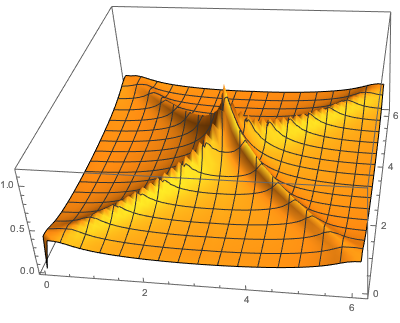
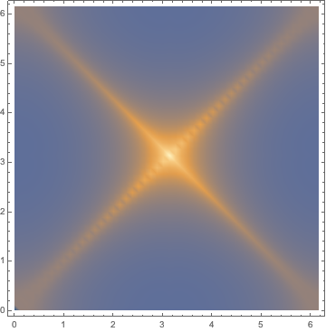
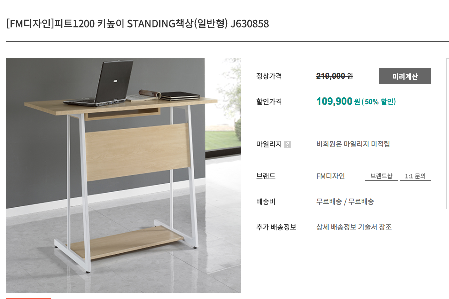

이전 기록  목록

* Diary (2016.01.03-2016.12.28)   [link (pages)](../../diary/diary20160103-20161228.pages)

* Diary (2017.02.28-2017.10.24)   [link (pages)](../../diary/diary20170228-20171024.pages)

***

* [physics book collection made by some Russian](http://nozdr.ru/biblio/kolxo3/p/ps)
* [ftp version physics book collection made by some Russian](ftp://nozdr.ru/biblio/kolxo3/P/PS/)

* [hohobooks link](https://band.us/@dailysentences108/band/68023777)

맥북 스크린 blackout 을 위해서는 다음과 같은 commandline 명령어를 쓰면 된다.
>
pmset displaysleepnow
이것을 ~/.zshrc 를 수정하여 qout 만 치면 blackout 되도록 설정하였다.

***

***

### 2017. 12. 18 (Mon)

1. 집 근처에 예술제본 공방이 있다는 것을 알았다.
    * 김덕주 교수님 책을 제본할 수 있을지 알아보자.

2. 외장 배터리가 왔다. 전선 코드를 구입했다. 하나는 옥션에서 오고 다른 하나는 아마존에서 올 텐데 기다려보자.

3. ASkX 에 대해서 노트를 저장해두자.

4. PRB 논문을 리뷰해야된다.

5. X. G. Wen 책이 상당히 유용하다는 것을 알았다. 공부해보자.

6. 틈틈히 fortran 90 책을 공부하고 있다. fortran 90  익숙해지도록하자.

7. Python 책도 구입했다. 공부해보자.

***

***

### 2017. 12. 17 (Sun)

1. 오늘은 나의 생일 잔치함.

    * 족발 사먹음.
    
2. nonperturbative RG는 무엇일까? 

    * 2007 년 arXiv논문을 다운받았다.공부해보자.

***

***

### 2017. 12. 16 (Sat)

1. aquamacs customization 을 저장하면 항상 에러가 떴었는데,
    * ~/Library/Preferences/Aqua\ macs/customization.el 파일이 잘못 되어서 그런 것이었다.
    * 수정하니까 제대로 작동함.

***

***

### 2017. 12. 15 (Fri)

1. RPA AB sublattice susceptibility layer index 에 있는것에 대해서도 계산을 완료했다.

***

***

### 2017. 12. 14 (Thu)

1. RPA AB sublattice susceptibility 를 구해보자.

2. analytic 한 표현식을 구해야할 거 같음.

***

***

### 2017. 12. 13 (Wed)

1. Docker 라는 시스템을 알았다.
    * 어제 abinit 이 작동이 안 되었는데, docker 로 설치하면 될 거 같다.

2. Wetzel 의 cuprate 상그림 with fRG calculations 논문이 arXiv에 올라왔다.
    * [2017 arXiv fRG Wetzel](../../2-study/my_project/FRG/_ref/cuprate-t-J-fRG/17-Wetzel-arXiv.pdf)

    * 시간날때마다 공부해보자.

***

***

### 2017. 12. 12 (Tue)

1. Fortran 95 self-study 해도 좋을 거 같다.

    * [fotran 96 self-study homepage also in Zotero](https://www.mrao.cam.ac.uk/~rachael/compphys/)

2. 김덕주 교수님 책을 실제본하기 시작했다. 시간 날때마다 프린트하자. 1-20 프린트할차례이다.

3. 연구실에 abinit uninstall 했다. brew와 macport 모두 지웠다. 나중에 다시 설치해야될 듯 하다.

***
***

### 2017. 12. 11 (Mon)

1. RPA 계산하기

    * 김덕주 교수님의 놀라운 책을 알게되었다.

2. 조수현씨 계산

    * 왜 3 $\theta$ 인지 생각해보기.
    * magnetic vectors를 생각할 수 있고, 그러면 monopole 을 생각할 수 있지 않을까?
    * 세개 성분이 모두 $\theta$ 일 필요는 없을 것이다.
    * 박철환 교수님논문 읽어보기.

3. Fortran 95 공부해도 좋을거 같다.
    * [fortran 95 pdf 45pages](../../downg/SelfStudyF95.pdf)

***

***

### 2017. 12. 10 (Sun)

1. RPA 계산하기.

2. ASkX 정리하기.

***

***

### 2017. 12. 09 (Sat)

1. 낮에는 오리고기 먹으러  동탄에 다녀왔다. 일인당 만원대에서 먹을수 있는 최상의 음식인듯하다.

2. BoxSync 를 zotero server로 사용할 수 있음을 알았다.

    * 장기적으로는 Box에 있는 project를 모두 dropbox 로 옮기고, boxsync는 zotero library 박스로 써야겠다.

3. Vienna RSS

    * local database 장소(~/Library/Application\ support/Vienna/messages.db) 를 ~/Dropbox/_RSS/messages.db 로 옮기면 편하다.
    * Todo 블로그에서 구체적인 명령어 확인할 것.

4. ~~Zotero의 note가완전히   Backup 되지않은거같다.  녹색 notebook과비교하면서 note가진짜   backup안되었는지확인해보자.~~ --> backup  되어있음.

***

***

### 2017. 12. 08 (Fri)

1. feedly 라는 feed 프로그램을 설치해서 arXiv 랑 PRL 관리하면 좋다.

2. 오전에 출근해서 QPI 에 대해서 관심이 생겨서 논문 두개를 스크랩해두었다.

    *  관련 페이지는 [Dropbox-2-study-my_project-QPI 에 있다.](../../2-study/my_project/QPI/QPI.html)

3. 박성준이 non-Hermitian  perturbation 에 대해서 발표했는데 Fermi arc 에 대해 적용시키면 좋을 거 같다. 특히 cuprate에서..

***

***

### 2017. 12. 07 (Thu)

1. RPA 계산계속해서 해보자.

    * 0jeschke 강의 노트에 $\chi^{+-}$ 에 대한 RPA 계산하는 것이 아주 자세하게 나와있다. 참고하자. 이것이 정답이다.

***

***

### 2017. 12. 06 (Wed)

1. 연구실에 있는 opera 창을 다 껐다. 계속 켜두니까 resource를 엄청나게 잡아먹는 것 같다.
퇴근전에 리부팅해서 qout 컴퓨터 창을 끄자.

2. journal에 대한 github 를 설치하려고 했었다. 하지만, 오늘 다시 열어보니까 최근 자료를 열람할 수 있었다. 고칠필요없을 거 같다.

3. orbital angular momentum 에 대한 생각. Rashba effect 에서도 local spin 을 정의할 수 없었지만, spintonics 로 기술할 수있었다.
그 이유는 전기장을 걸어주면, 한쪽 spin의 기여도가 커지게 되므로 real-space 에서 스핀의 크기가 변하게 되는 것이다.
orbital angular momentum 역시 같은 이야기를 전개할 수 있다.
여기에 대한 논문을 생각해보자.

4. 조수현씨 계산을 마무리 하자.

5. RPA 계산

    * $\rho^i(\tau)$ 에 미분을 건다는 것은 $c_k (\tau)$ 에 미분거는 것과 같은 것이다.
그러면 항이 너무 많아지기 때문에 $G(k, -\tau), G(k+q, \tau)$ 에 미분을 거는 것이 나아보인다.

    * latex으로 정리해야된다.

6. ASkX 에 대한 노트도 만들자.

7. Laughlin 논문을 모두 따라갈수 있을까?

    * 우선 가장 최근 [2014년 PRB](../../2-study/my_project/Laughlin/_ref/14-Laughlin-high-Tc-cuprate-PRB.pdf)
    * 사람들은 말이 많지만,  Laughlin 은 message를 정확하게 던지고 그것에 답하는 듯하다.

8. P. Phillips 책 마지막 chapter 가 상당히 유용해 보인다.

***

***

### 2017. 12. 05 (Tue)

1. Hamiltonian을 바꾸어서 프로그램을 돌려놓았다.
    * p 와 $\alpha$ 에 대해서 skyrmion antiskyrmion 을 정의할 수 있을 것이다.
    * 하나의 동역학을 기술해보자.
    * helical state 의 k vector 는 어떨 것인가?
    * Bogdanov 의 식이 틀렸는지, 아니면 Parkin 의 논문이 틀렸는지 살펴보자.

2. MC 계산이 끝나면 조수현씨 계산을 하자.

3. 그동안 RPA 계산을 보고 있자.

    * 빨간책을 보면서 RPA 를 어떻게 계산하는지 알아보았다.
    * 그러면, Schrieffer 논문에 있는대로 $\langle \rho^0({\bf q}, \tau) \rho^0({-\bf q}, 0) \rangle$ 와
$\langle S^z ({\bf q}, \tau) S^z({-\bf q}, 0)\rangle$ 의 RPA 에서 왜 분모에 부호가 다른지 알아보자.

***

***

### 2017. 12. 04 (Mon)

1. RPA 계산

* 장론책은 RPA 부분 보았다. 빨간책 p256 에 있는 과정 따라가면서 유도해보기.

2. numerical calculations 조수현

* div = 100 은 아무래도 너무 끝 숫자인거 같다. div = 50으로 해서 돌려놓고 퇴근하자.

3. antiskyrmion lattice model

* 온도를 T = 0.4 로 고정하고 H = 0.0 에서 3.5 로 증가시키면서 MC 를 계산해보았다.
H = 2.0 에서 antiskyrmion 격자가 생기는데, 사각 anti-skyrmion 격자가 생겼다.

* 그리하여 H = 2.0 으로 고정시키고, 온도를 낮추어가면서 계산하고 있다. 결과를 확인하고 퇴근하자.

* CP1 파동함수 구하기.

* 홀 효과 계산하기.

* \alpha 를 바꾸어가면서 상그림을 그리기.

***

***

### 2017. 12. 03 (Sun)

1. 효원이 생일이다. 장소는 가인채에서 샤브샤브 먹었다.일요일 모임은 진관이네 교회때문에 1시에 하는 것이 좋다.

* 진관이네로부터 털실 모자랑 목도리 세트 받았다.

* 아빠가 점심값내고,

* 엄마가 책 사주었다.

* 그리고 기창이형 큰어머니로부터 돈 받음.

2. dropbox 와 github를 연동해도 문제없음이 밝혀졌다.

***

***

### 2017. 12. 02 (Sat)

1. 토요일 오전에 할리스에 왔는데, 조용히 책읽고 있기에 좋은 곳인거 같다.

2. Quantum field theory for gifted amateur 는 아주 대박인 책인거 같다. 가까이 두고 읽고 또 읽자.

3. 노트북 보조 배터리를 알아보고 있는데, 문득 맥세이프가 무사히 있는지 궁금해졌다. 찾아보자.

* Youtube도 있다.

4. finder의 시작 폴더를 dropbox로 해두자.

***

***

### 2017. 12. 01 (Fri)

1. 12월이다. 한해를 잘 마무리하자.

2. GaAs 계산은 좌표를 어떻게 잡으면 좋을지 알았다. 잘 계산해보자.

3. RPA 계산을 해야된다.

***

***

### 2017. 11. 30 (Thu)

1. RPA 계산하고, domain wall 계산할것.

* domain wall 계산은 domain wall를 fourier 변환을 하고, 다른 방향은 open boundary 를 해서 계산하면 된다.

***

***

### 2017. 11. 29 (Wed)

1. 조수현씨에게 계산결과를 보내주었다.

* 피드백으로 좀더 촘촘하게 계산해서 LH과 HH에 대해서 계산하자는 것이었다.

* strain 효과에 대해서 좀 더 살펴보자.

2. skyrmion liquid

* Vojta 의 arXiv 논문을 보다가 skyrmion liquid 라는 것이 있어서, 논문을 link 해둔다.
[17-Vojta-skyrmion-liquid, arXiv](../../2-study/my_project/skyrmion/_skyrmion_liquid/_ref/17-Vojta-skyrmion-liquid-arXiv.pdf)

3. dropbox 1Tb 결제함.

dropbox 6GB에서 허덕이다가 충동적으로 1Tb, 99달러에 결제했음.

***
***

### 2017. 11. 28 (Tue)

1. 실공간에 대한 tight-binding 계산하기.

* __실공간에 대한 tight-binding 모델역시 latex으로 정리해둬야한다.__

2. 조수현씨 계산 하기.

3. Mishchenko 의 논문을 보면서 hole + t-J 모델을 어떻게 QMC 로 구현할 수 있을지 고민해보기.

* Mishcenko 와 Nagaosa 는 오래전부터 친구와 같은 관계였나보다. Mishchenko 의 논문을 보면서 QMC 를 익히도록해보자.

***

***

### 2017. 11. 27 (Mon)

1. 실공간에 대한 Hamiltonian 완성하기.

* Hamiltonian이 어떻게 생겼는가에 대해서 이해했음.

* --> A, B sublattice 에 대한 이해를 더 해야될 필요가 있음.

* 이제 code 작성하면 된다.

2. 조수현씨로 부터 연락이 왔다. 계산해보자.

***

***

### 2017. 11. 26 (Sun)

1. 오전에는 효원이 산타할아버지에 대한 연극 보러가고,

* 나는 유하랑 늦게 수원시청역으로 가서 가족이랑 같이 점심먹었다. 즐거운 시간을 보냄.

2. 효원이가 밤에 면도칼을 만져서 손 베임. 조심해야됨.

3. 저녁에 할리스가서 BJ Kim 발표를 정리함.

***

***
### 2017. 11. 25 (Sat)

1. Jishi 책보면서 RPA 공부했는데, Wick's theorem 과 1st order correction 를 구해보면 RPA꼴을 알 수 있을 거 같다. Schrieffer, Wen, Zhang 논문 보면서 기존의 결과와 같이 나오는 지 확인해보자.

***

***
### 2017. 11. 24 (Fri)

#### 1. Bruus 책보면서 RPA계산하는데,

* equation of motion 방법은 뭔가 복잡하다. Feynmann 책에 있는 Wick's theorem 을 공부해서 계산해보자.

#### 2. real-space 에서 tight-binding 공식을 구하고 있다.

* 가장 간단한 대각성분 구했다. 다음은 대각성분의 second-nearest neighbor 하면 된다.

***

***
### 2017. 11. 23 (Thu)

#### 1. Bruus 책에 RPA calculation 자세하게 나온다.

* 참고해서 우리 모델에 대한 RPA 공식을 유도해 보자. [book link](/Users/parkjinhong/MEGA/1000-Physics-BOOK/Physics Complete/Modern Physics/Quantum Field Theory/Bruus_Flensberg_Introduction To Quantum Field Theory In Condensed Matter Physics.pdf)

#### 2. Fazekas 책은 oxide 문제에 대해서 진리와 같은 책이다.

* 가까이 두고 계속해서 공부해보자.

***
***
### 2017. 11. 22 (Wed)

#### 1. iridates

* 일단 Fermi surface 를 그려보자.

* domain wall은 무엇을 말하는 것일까? 진호섭 교수님의 AFM 1D AFM edge chain에 대해서 말씀하시는 것이다.
[email communication](/Users/parkjinhong/Dropbox/2-study/my_project/nonsymmorphic_SM/_email-communications/20171109-Manuscript-on-dispersionless-Dirac-line-node-by-Hosub-Jin.pdf)

-> 가장 쉬운 방법은 numerical 하게 확인하는 것이다.

* 상그림을 일단 완성해보자.

#### 2. 건강검진

매일 밤 운동을 할 수 있을까? 벌말 초등학교가 그나마 가까운 학교인듯하다.

#### 3. group symmetry in semiconductor

[link html]

여기에 고체에서 group symmetry 와 strain effect에 대해서 자세히 나온다.

[Bir G.L., Pikus G.E. Symmetry and strain-induced effects in semiconductors](/Users/parkjinhong/MEGA/1000-Physics-BOOK/_link/Bir-Symmetry-strain-induced-effects-in-semiconductors.pdf)

#### 4.doping effect논문

[PhysRevB.95.235125](https://journals.aps.org/prb/abstract/10.1103/PhysRevB.95.235125)

[PhysRevLett.117.107001](https://journals.aps.org/prl/abstract/10.1103/PhysRevLett.117.107001) persistence magnon

#### 5.토너구입
토너구입했다. [관련자료 link](/Users/parkjinhong/NAVER Cloud/2_my_doc/1_IBS/2017/_blank.pages)

파일올릴때는 파일명을 최대한 단순화해서 업로드하는것이 에러를 줄일수 있는 방법이다.

***

***
### 2017. 11. 21 (Tue)

#### 1. susceptibility계산 정리하고, RPA 계산 해볼것. (Fazekas 책 보면서)

* susceptibility 계산 정리했는데, interlayer hopping을 고려하면 log 발산이 나오지 않았다.

* 이제 RPA계산 유도해보자.

* phase diagram 을 그려보자.

* domain wall 에 대해서도 생각해보자.

#### 2. 학회질문.

[Solvay 2007 proceeding](/Users/parkjinhong/MEGA/1000-Physics-BOOK/_link/Solvay_proceeding.pdf) 논문을 보면서 세미나에서 어떤질문을 하면 좋을지 생각해보자.

#### 3. apache2 서버 공유

port 22 를 통해서 연구실 apache2 서버를 구축하려고 했는데, 안 된다. 다른 port를 열어야할 듯.

***

***
### 2017. 11. 20 (Mon)

#### 1.오늘은 susceptibility계산을했다.

***

***
### 2017. 11. 19 (Sun)

#### 1. mean-field 계산에 대해서 검색하다가 찾은 두개의 site

* [aamaricci TB, mean-field, DMFT](https://github.com/aamaricci)

* [TBM3](https://github.com/TDIV/TBM3)

#### 2. dokuwiki 설정법

* macOS 별 apache2 서버 설정 방법 [참고한 webpage](https://discussions.apple.com/docs/DOC-3083)

[1]

>
__sudo vi /etc/apache2/httpd.conf__

Enable PHP by uncommenting line 176, changing:

\#LoadModule php5_module libexec/apache2/libphp5.so

to

LoadModule php5_module libexec/apache2/libphp5.so

***

at line 177

\#LoadModule perl_module libexec/apache2/mod_perl.so

to

LoadModule perl_module libexec/apache2/mod_perl.so

***

at line 173

\#LoadModule userdir_module libexec/apache2/mod_userdir.so

to

LoadModule userdir_module libexec/apache2/mod_userdir.so

***

at line 513

\#Include /private/etc/apache2/extra/httpd-userdir.conf

to

Include /private/etc/apache2/extra/httpd-userdir.conf

***

save and quit

***
***

>
__sudo vi /etc/apache2/extra/httpd-userdir.conf__

at line 16

\#Include /private/etc/apache2/users/*.conf

to

Include /private/etc/apache2/users/*.conf

save and quit

***
***

>
__mkdir ~/Sites__

>
__echo \"\<html\>\<body\>\<h1\>My site works\</h1\>\</body\>\</html\>\" \> ~/Sites/index.html.en__

>
__sudo vi /etc/apache2/users/\<your short user name\>.conf__

Use the following as the content:

\<Directory \"/Users/\<your short user name\>/Sites/\"\>

AddLanguage en .en

AddHandler perl-script .pl

PerlHandler ModPerl::Registry

Options Indexes MultiViews FollowSymLinks ExecCGI

AllowOverride None

Require host localhost

\</Directory\>

>
__apachectl configtest__

If this command returns "Syntax OK" then you are ready to go.

>
__sudo launchctl load -w /System/Library/LaunchDaemons/org.apache.httpd.plist__

In Safari, navigate to your web site with the following address:

http://localhost/

It should say:

>
It works!

Now try your user home directory:

http://localhost/~ \< your short user name \>

It should say:

>
My site works

***

***
### 2017. 11. 17 (Fri)

#### 1. interlayer hopping terms을 고려해서 susceptibility계산

Hamiltonian을 만들어보자.

#### 2. 일본 출장비

일본 출장비가 아직 안 나왔다. 빨리 나와서 금전흐름이 어떻게 되는지 빨리 정해졌으면 좋겠다.

#### 3. 퇴근후 이어폰이 없다는 것을 알았다. 연구실에 있을려나..?

***

***
### 2017. 11. 16 (Thu)

#### 1. hohobooks 출근 시간에 들었음.

매일 hohobooks 를 들을 수 있을까? 오늘 4호선 구간에서 hohobooks 반복해 들으면서 왔다.

#### 2. susceptibility using tetrahedron method

interlayer hopping 들어 갔을 때 susceptibility 계산하기.

#### 3. Bergman Balents 2008년 논문, kindle 버전으로 만들었다.

#### 4. mean-field 계산 다른 방법도 있다고 했는데, 그건 어떤 방법일까? -> Fazekas 논문 보고 확인하기.

#### 5. 박세영 박사님과 대화 기록.

* Hund's metal은 아주 낮은 온도에서는 Fermi liquid behavior를 보여서 resistance가 $T^2$ 로 증가하다가 어느 온도 영역에서는 Hund coupling 이 중요해지면서, resistance가 T linear하게 증가하는 metal.

* igor 라는 Rutgers 대학교 교수가 cooper pairing의 새로운 argument로 설명했는데, 2차원 quantum well 에서는 electron bound state 가 존재할 수 있다. 이것을 약한 weak attractive U 에 대해서 instability 로 설명함.

* YbMnBi2 nonsymmorphic symmetry에 의해 protected 되는 Dirac point.

#### 6. Ziman talk 를 들었다.

* sign of Hall resistance 가 negative 라는 말은 carrier type이 electron이라는 것이고, hole type fermi surface 가 CDW 에 의해 reconstruct되는 이야기가 자연스러워 보인다.  interlayer hopping에 의해서 어떻게 hole type fermi surface가 electron type fermi surface 로 reconstruct될 수 있을까?

***

***
### 2017. 11. 15 (Wed)

#### 1. iridates

* 어제 에너지 밴드 그려보고, chemical potential 과 각도를 확인했다. 그리고 온도가 beta = 1000 일때 우리가 원하는 log 발산이 나옴을 확인했다. beta = 1000 이면 t = 10 도 가량 되는 값이다.

* 지금 하고 있는 것은 log sampling를 해서 log 발산이 좀 더 극적으로 보이게 하는 것이다.

* 오늘 해야되는 것은 single layer 에 대해서 각도별로 발산하는 그림을 완성하는 것이다. -> 예전에 했던 single layer 의 각도와 각도에 따른 chemical potential 찾아서 정리해야됨.

* 그리고 interlayer coupling 이 들어갔을 때의 Hamiltonian 을 완성하는 것이다.

#### 2. hohobooks

* 매일 hohobooks 를 쉐도우리딩을 할 수 있을까? 일단 오늘 file를 다운 받았다.

#### 3. 포항 5.4 지진

포항 흥해에서 5.4 지진이 낮 2시경에 발생하였다. 엄마는 목욕탕있다가 대피하셨고, 아빠는 집에서 밖으로 대피하심.
집안의 물건은 이것저것 떨어졌지만, 크게 파손된 물건은 없다고 한다.

***

***
### 2017. 11. 14 (Tue)

#### 1. 3-5족 반도체

* 50x50x50 에 대해서 Berry curvature data를 만들어서 줄 것.

#### 2. iridates

* energy bands 를 그려보고, chemical potential 과 각도를 확인해 볼 것.
* RPA 계산하기.

#### 3. SSD 500G  구입을 위해서 돈을 모아 볼 것.

***

***
### 2017. 11. 13 (Mon)

#### 1. Tetrahedron methods iridates 모델에 대해서 적용시켜보기

* Raghu model 까지 잘 돌아가는 것을 확인했다. 이제 iridates 모델에 적용시키자.
* 일단 single layer 에서 log 발산이 나오는가를 확인한 다음에 layered system으로 가자.
* single layer 공식 정리했다. [html link](../../../Desktop/_Rath-Freeman-methodaaa_single-layer-iridates/tetrahedron_single-layer-iridates_susceptibility.html) -> Desktop link추후  Box sync link로바꿀것.
*이제 cpp코드작성하고   single band에서   susceptibility가 발산하는지먼저계산해보자.

#### 2. RPA계산유도해볼것.

***
***

### 2017. 11. 12 (Sun)

#### 1. 아빠 생신

오늘 아빠 생신이라 동탄 풀입채에서 같이 식사함. 즐거운 시간을 보냈다.
생신 선물로는 asus 노트북을 선물드림.

#### 2. hohobooks

* [hohobooks link](http://hohobooks.kr/sentences) 를 오늘 다시 한번 했다. 굳이 녹음할 필요는 없는듯.

* [네이버 밴드 link](https://band.us/band/68023777?invitation_url_id=a0abv3r7weQdz)

***

***
### 2017. 11. 10 (Fri)

#### 1. RIKEN 보고서 작성

이번 일주일은 RIKEN 학회에 참석하고, 목요일은 건강검진을 받았다.
학회 참석후 서류작업은 여기에 저장해 두었다. [2017 리켄 출장 결과 보고서](../../2-study/my_project/nonsymmorphic_SM/PPT/_201711_RIKEN_workshop/_doc/_blank.pages)

#### 2. Raghu model 에 대해서 susceptibility 계산하기.

* 계산 과정 정리하는 [html link](../../../BoxSync/project/10_Laughlin/_sus_subroutine_original_tetra5_lindhard3/_cpp/_Rath-Freeman-methodaaa_Raghu/tetrahedron_Raghu_susceptibility.html)

* cpp code에입력하면된다.

#### 3. mac 세팅

Desktop 1-6 를 open 하고 1(finder), 2(opera), 3(mail), 4(calendar), 5(kakaotalk), 6(R, xcode) 을 열어둔다.

***

***
### 2017. 11. 06 (Mon)

#### 1.연구자의길
 
 인터넷에서 연구자의 길이라는 글을 읽었다. [옮긴글 link](../../../NAVER Cloud/2_my_doc/2_etc/_life-of-researcher/life-of-researcher.html)

#### 2. RIKEN symposium 에 참가중
RIKEN symposium에 참가중이다. 정리한 내용을 [link](../../2-study/my_project/nonsymmorphic_SM/PPT/_201711_RIKEN_workshop/rikenworkshop201711_content.html) 한다.

***
***

### 2017. 11. 03 (Fri)

#### 1.DMFT와 Gutzwiller variational methods
 
어제박세영박사님이랑  식사하면서 들었는데  DMFT와   Gutzwiller variational methods  이렇게 두가지가   correlated system을   기술하기위한  method라고할수있다고했다. 
공부해보도록  하자.

#### 2.Tetrahedron methods   

* 사각격자에 대해서   susceptibility계산  중간에 비워져있는   points  들을메우고있다.  이것이다끝나면,  __2D계산__ 과   __Raghu계산__ 을해보자.

* ~~Fermi-Dirac 함수가어떻게들어갈수있을지도확인해봐야된다.~~  ...> $$  \left( f_{FD}(E_{\nu}( {\bf k})  ) - f_{FD}(E_{\nu'} ({\bf k} + {\bf q}) ) \right) $$ 를  공식에곱해주면된다. 

*  2D계산에서  tetrahedron좌표와  q벡터의방향과관련이있어보인다.

에서볼수듯이   q벡터가   (0,2pi) -> (2pi,0)로 갈때는 부드럽지만,

(0,0)에서  (2pi, 2pi)로갈때는부자연스럽다.
tetrahedron를   (0,0), (1,0) (1,1) 의좌표에서잡고계산해서 그런것으로지금은해석하고있다.

#### 3. 박세영박사님어제발표  update했음.  

[link (html)](../../../OneDrive/4-Seminar/2017/20171102-SrVO3-LaVO3/SrVO3-LaVO3.html)

***
***

### 2017. 11. 02 (Thu)

#### 1. tetrahedron method 로 susceptibility발산하는것확인하기.

사각격자에서   q = (pi,pi)에서  susceptibility  가발산함을확인했다.  BZ의   mesh  를작게 하면  할 수록   susceptibility   가   조금씩 커졌다.  일단이 커지는것이 수렴한다는것을보여야할   텐데,   일단그것은 나중에하는것으로  하고,     BZ  를    20000  으로  나눈   Mesh 를써서   계산하였다.   
Log  divergence 가 잘나옴을확인할수있다. 

[folder link](../../../BoxSync/project/10_Laughlin/_sus_subroutine_original_tetra5_lindhard3/_cpp/_blank.pages)

#### 2. 박세영 박사님발표

[link (html)](../../../OneDrive/4-Seminar/2017/20171102-SrVO3-LaVO3/SrVO3-LaVO3.html)

#### 3. AIP publishing에서   mail 이와서회원가입을했다.

AIP publishing  계정에가입했음.
아이디는 jinhon9.park@gmail.com 이고비번은많이쓰는비번이다.

[AIP publishing](http://aip.scitation.org)

#### 4. k.p theory   
GaAs에서 [111], [001]평면에대한   Hamiltonian 을유도할 수있을거같은논문을찾아서일단저장해둔다.

[누군가의졸업논문](../../2-study/my_project/OAM transport/GaAs/_ref/cgaleriu.pdf)

***

***
### 2017. 11. 01 (Wed)

#### 1.tetrahedron method 로 susceptibility발산하는것확인하기.

* 일단먼저   analytic expression부터구하기. [note (pdf)](../../2-study/my_project/nonsymmorphic_SM/latex/_tetrahedron/_tetrahedron_2d/tetrahedron-2D-note.pdf)

* mathematica file은   Boxsync 에 있다. [mathematica file](../../../BoxSync/project/10_Laughlin/_sus_subroutine_original_tetra5_lindhard3/_cpp/_2D_analytic_expression/_blank.pages)

* 이제 code를 작성해보자. 
[folder link](../../../BoxSync/project/10_Laughlin/_sus_subroutine_original_tetra5_lindhard3/_cpp/_blank.pages)

#### 2.  standing desk

[Livart제품](http://mall.hyundailivart.co.kr/front/productDetail.lv?gdidx=A6734001066&cate1cd=CATE00000004&cate2cd=CATE00000024&cate3cd=CATE00001176)이 괜찮은 거 같다.  

***
***

### 2017. 10. 31 (Tue)

#### 1. KPS결과 보고서

KPS결과보고서를 작성함.  작성하면서  [ 김준성교수님의   C4  symmetry  가보존되는새로운    상  ](../../2-study/my_project/Pnictides/C4_symmetry/_ref/17-Ok-JSKim-C4-symmetry-FeSC-arXiv.pdf)  에대한관심이생겼음.

#### 2. APS membership

[link html](../../2-study/my_project/nonsymmorphic_SM/PPT/_2018_march_meeting_APS/APS2018Marchmeeting.html)

#### 3.tetrahedron method 로 susceptibility발산하는것확인하기.

[folder link](../../../BoxSync/project/10_Laughlin/_sus_subroutine_original_tetra5_lindhard3/_cpp/_blank.pages)

2D모델에서 analytic form  을계산했음.각각의 limit에대해서   계산함.

#### 4. tight-binding description 에 대해서 electric conductivity 구하기

[link html](../../2-study/my_project/Ruthenate/Li2RuO3/Li2RuO3.html)

윤석환 학생이 말한 dimer 에서 resistivity 가 온도변화에 대해 flat 한 현상을 설명하기 위해서 우선 tight-binding model 로 부터 electric conductivity를 구하는 방법을 익힐 필요가 있을 거 같다. 그래서 찾은 논문이 [ tight-binding-model vs. electric conductivity (pdf)](../../2-study/my_project/Ruthenate/Li2RuO3/_ref/11-Kuzemsky-tight-binding-model-electric-conductivity-IJMPB.pdf)

* 금속의 conductivity에서는 낮은 온도에서는 electron-electron interaction 이 중요하고, 높은 온도에서는 phonon contribution 이 커진다.

* insulator 에서는 thermal excitation 이 중요한데, 온도가 올라감에 따라 thermal excitation 은 볼츠만 상수에 비례해서 exponential 하게 증가한다.

***
***

### 2017. 10. 30 (Mon)

이 플랫폼으로 diary 를 쓸 수 있을까? 시도를 해보자.

#### 1. TI 에 Mn를 doping하여 skyrmion 

TI 에 Mn를 doping하여 skyrmion를 구할 수 있었다는 논문이 있어서 스크랩해둔다.
[TI skyrmion (html)](../../2-study/my_project/skyrmion/_TI_doping_skyrmion/TI_skyrmion.html)

#### 2. APS 등록 관련 [link html](../../2-study/my_project/nonsymmorphic_SM/PPT/_2018_march_meeting_APS/APS2018Marchmeeting.html)

#### 3. double quantum dot최신논문 kindle로만듬.
double quantum dot논문이 PRL에나왔기에 kindle로만들어서읽어보려고한다.
그와중에  macbook에  tool bar가사라진것을되돌리수있는방법을알았다.집에가서해볼것.

그새로운논문은 [17-Hofmann-Ihn-DQD-PRL (pdf) ](../../../google-drive/downg/17-Hofmann-Ihn-DQD-PRL.pdf)

#### 4.리켄 1분발표자료만들기

[folder link](../../2-study/my_project/nonsymmorphic_SM/PPT/_201711_RIKEN_workshop/_blank.pages) ...>완료함.

#### 5.tetrahedron method 로 susceptibility발산하는것확인하기.

[folder link](../../../BoxSync/project/10_Laughlin/_sus_subroutine_original_tetra5_lindhard3/_cpp/_blank.pages)

#### 6. KPS 2018가을물리학회정리함 [link (html)](../../2-study/my_project/nonsymmorphic_SM/PPT/_201710_KPS/KPS2018Fall.html)

#### 7. 집에와서는 국내출장결과보고서를  제출하였다.
[출장보고서_박진홍.numbers link](../../2-study/my_project/nonsymmorphic_SM/PPT/_201710_KPS/_blank.pages)

***
