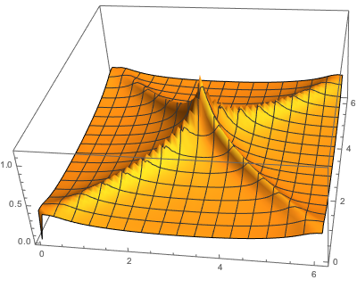
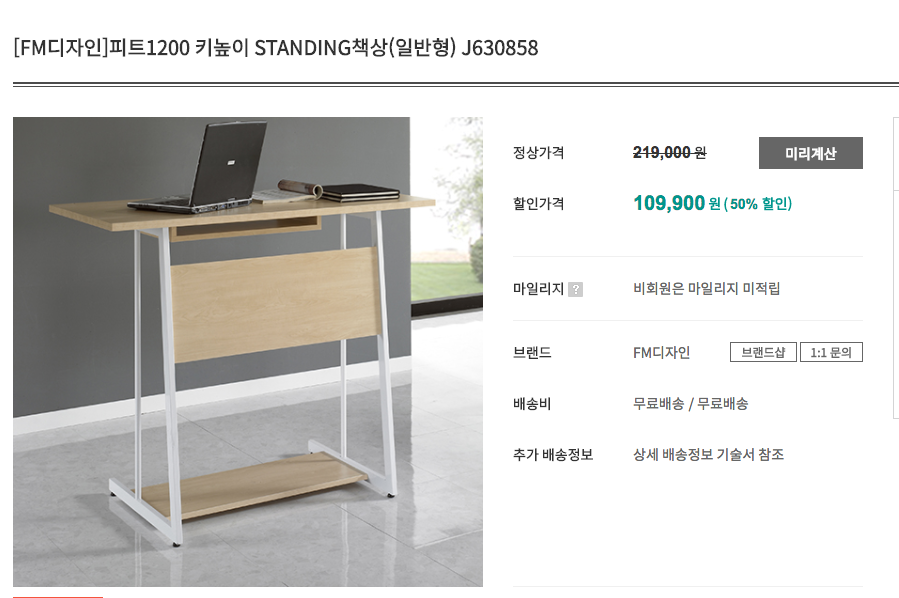

<head>
   <link rel="stylesheet" type="text/css" href="codes.css" />
</head>


***

 * [journal review](./journal.html)


***
 * [~/.emacs 파일](./emacs.html)

***

* [jupyter 다중 커널 설정하기](jupyter-notebook-kernel.html)

***

* [List of questions](questions.html)

***

<div class="md", id="two">
md files <br>
<a href="../../2-study/my_project/graphene superlattice/_twisted_multilayer_graphene/_md/twisted_bilayer_graphene.html">twisted bilayer graphene</a> // <a href="../../2-study/my_project/hydrodynamics/_Hartnoll/_md/bad_metal_Hubbard_model.html">bad metal extended Hubbard model</a> // <a href="../../../OneDrive/4-Seminar/2018/2018MARCH_meeting/1_J. Cano/_md/cano.html">J. Cano 2018 APS</a> // <a href="../../../OneDrive/4-Seminar/2018/2018MARCH_meeting/SC.Zhang/_md/SC.Zhang.html">SC.Zhang 2018 APS</a> // <a href="../../2-study/my_project/SC_iridates/chubukov_ref.html">Chubukov graphene SC</a> // <a href="_Baskaran/Baskaran.html">Baskaran arXiv 2016:Anderson Gardening</a>
// <a href="../../2-study/my_project/nonsymmorphic_SM/latex/_LDA_iridates/LDA_iridates.html">LDA Iridates</a>
// <a href="../../2-study/my_project/Exciton/_exciton_graphene/exciton-graphene.html">graphene exciton</a>
</div>

***

***

* [physics book collection made by some Russian](http://nozdr.ru/biblio/kolxo3/p/ps)  
* [ftp version physics book collection made by some Russian](ftp://nozdr.ru/biblio/kolxo3/P/PS/)  
* [http://b-ok.org/](http://b-ok.org/)  
Parravicini 고체책 좋음.  

맥북 스크린 blackout 을 위해서는 다음과 같은 commandline 명령어를 쓰면 된다.
>
pmset displaysleepnow
이것을 ~/.zshrc 를 수정하여 qout 만 치면 blackout 되도록 설정하였다.

	link                  ../../2-study/

markdown color 를 넣고 싶다면

```
<span style="color:blue">   </span>
```

cmd+shift+f : recent file in finder

***


---

#### 2018. 05.04 (Fri)

1.  오랫동안 PRB 를 스크랩하지 않았는데, 오늘 몰아서 스크랩하였다. 내일은 arXiv 스크랩해보자. 


---

#### 2018. 04.29 (Sun)

1. 지난한주는 연구실에서 arXiv 랑 PRB 스크랩을 하지 않았다. 대신 연구를 했음. 얼마나 효율적인지는 모르겠지만, 의무적으로 논문 스크랩하는 것도 크게 도움은 되지 않는다.  

1. hohobooks 녹음하고, world  news 도 녹음했다.   


---

#### 2018. 04.24 (Tue)

1. 비트코인이랑 유체와의 연관성을 연구했다고 한다. 별거 아닌거 같지만, 좀 생각해보고 일반인들에서 설명해주면 좋을 거 같아서 스크랩해둔다.  
   [physcis news 비트코인 유체](https://phys.org/news/2018-04-swirling-liquids-similarly-bitcoin.html)  

1. 유용한 finder 단축키 cmd+shift+f 는 최근 열었던 파일을 알려주는 기능을 가지고 있다.   

---

#### 2018. 04.23 (Mon)

1. unit cell doubling 되면 basis vectors 도 다시 잡아줘야된다. Hermele 의 graphene 논문을 참고하자. **Hermele PRB 2007**


---

#### 2018. 04.13 (Fri)


1. TI lecture  
[https://ocw.tudelft.nl/course-readings/literature/](https://ocw.tudelft.nl/course-readings/literature/)  


---

#### 2018. 04.12 (Thu)

1. 어제 이현우교수님 논문 보다가 downfolding 이라는 용어가 나와서 궁금했는데, 그 의미는 다음과 같다. 제일원리 계산에서 에너지 밴드에 관여하는 orbital 갯수가 많으면 basis transfomation 방법으로 그 갯수를 줄일 수 있는데, 그 방법을 downfolding 이라고 한다. 이것은 여러 hybridized energy bands를 하나의 오비탈에 대한 effective 하게 표현한다는 의미로도 쓸수가 있다. 그에 대한 몇개 논문을 첨부하면 다음과 같다.  

[Imada PRB 2013](_ref/downfolding/Imada downfolding PRB 2013.pdf)  
[Fujiwara downfolding PRB 1997](_ref/downfolding/Fujiwara downfolding PRB 1997.pdf)  
[Aryasetiawan KITP PPT](_ref/downfolding/Aryasetiawan_MaterialDesignConf_KITP.pdf)  

---

#### 2018. 04.08 (Sun)

1. RIXS, K, L, M edge 가 무엇인지 궁금하면 van der Brink RMP 2011논문을 참고해보자.   
[RIX presentation](../../../OneDrive/4-Seminar/2017/20171118-Kang_RIX/Kang.Soomin_RIX.html)  
[RIX RMP 2011](../../../OneDrive/4-Seminar/2017/20171118-Kang_RIX/_ref/RIX RMP 2011.pdf)  

1. PRL 리뷰 온 거 정리함.  
리포트 제출해야된다.  

1. hohobooks 저장함.  

1. machine learning 비디오 저장함  


---

#### 2018. 04.07 (Sat)

1. 벗꽃 계절을 맞아서 서울 대공원 어린이 동물원에 다녀왔다. 양에게도 풀도 직접 줄수 있고, 무엇보다도 효원이가 재미있어해서 즐거운 하루였다. 


---

#### 2018. 04.06 (Fri)

1. 처음으로 PRL third referee 로의 기회가 왔다. 빠른 시간내에 결정을 내려보자.


---

#### 2018. 04.05 (Thu)

1. 오전에 와서 arXiv 정리와 talk 발표정리하였다. 오늘은 P. Phillips 가 twisted bilayer graphene 에서 Wigner crystal 에 대해 논하였다.


---

#### 2018. 04.04 (Wed)

1. twisted bilayer graphene 논문들을 보다가 Baskaran 이란 물리학자를 알게 되었는데, PW. Anderson 의 collaborator 로 cuprate RVB 이론에 지대한 영향을 끼친 인물이라는 것을 알았다. 그래서 그의 논문 모음을 위 collection에 모아두었다.  

1. Pachos methods 부분읽고 mean-field 부분에 무엇을 넣을지 생각해두자.

---

#### 2018. 04.02 (Mon)

1. jupyter python2, python3 가 가능하도록 설정함. 위의 jupyter 다중커널 설치하기 참조.


---

#### 2018. 03.29 (Thu)

1. 가진이가 드디어 태어났다. 2018.03.29 14:08 탄생. 축하한다.

1. 그림을 다 그렸다. 이제 Methods 와 Supplementary information 을 채워넣자.


---

#### 2018. 03.27 (Tue)

1. 가진이가 아직 태어나지 않아서 엄마, 아빠가 진관이집에서 일주일 동안 머무르다가  오늘 내려가셨다.  가진이는 아마도 41주정도 되어서야 나올려나보다. 건강하게 나왔으면 좋겠다.  

1. arXiv 는 오늘 업데이트되지 않았다. 


---

#### 2018. 03.26 (Mon)

1. 연구실에 파티션이 왔다. 자석을 준비하면 파티션에 무엇인가를 붙일 수 있을 거 같다. 


---

#### 2018. 03.23 (Fri)

1. feedly 와 arXiv 스크랩하였다. 이제 그림이랑 RPA, tetrahedron method 정리해보자.


---

#### 2018. 03.22 (Thu)

1. 오늘 흥미로운 논문이 몇개 나와서 스크랩해둔다.  

###### tight-binding model  for twisted graphene  
* Electronic structure and optical properties of twisted bilayer graphene calculated via time evolution of states in real space (Vietnam group, tight-binding model for twisted graphene)  
[md 로 정리해둠](../../2-study/my_project/graphene superlattice/_twisted_multilayer_graphene/_md/twisted_bilayer_graphene.html)


###### H. Y. Hwang STO superconductivity  
* Polaronic behavior in a weak-coupling superconductor (STO superconductivity, H. Y. Hwang, PNAS)  

2. 책을 가지고 다니면서 읽는 것도 좋을까? 무슨책? PW Anderson 책은 어떨런지

3. RPA 계산이랑 tetrahedron 계산 정리해야된다. 이거 정리해둔게 있을런지.


---

#### 2018. 03.21 (Wed)

1. Feedly와 arXiv 정리하고 다시 soliton 정리해보자.
   오늘 feedly를 보다가 WS2 물질에 전류를 흘려주었더니 초전도체가 되었다가 어느 이상의 전류를 흘려주면 다시 insulator로 돌아온다는 논문이 있었다. 그 원리가 무엇인지 궁금하다. 

1. 박제근 교수님이 제안하시길 honeycomb lattice 에서 skyrmion 나오는지 확인해보자고 하셨다.


---

#### 2018. 03.20 (Tue)

1. 계속해서 soliton 계산을 하고 있다. 현재는 2 by 2 행렬꼴로 표현하는데 성공했다.


---

#### 2018. 03.18 (Sun)

1. 가족들의 성원에 힘입어 유하의 돌잔치를 잘 마무리했다. 장소는 동탄 삿뽀르였는데 자리가 협소해서 불편하였다. 에초에 가족들만 모이기로 했지만, 늦게 모임이 커지면서 방을 하나 더 빌리기로 했다. 하지만 모임 당일날 우리가 모임시간에 딱 맞추어가는 실수(원래 host가 조금더 일찍 가야하는건데)때문에 지영이네 큰외삼촌이 행사에 참석 안 하고 그냥 나가시는 불상사가 발생했다. 그러한 행사진행상 미숙함이 있었지만 유하가 울지않고 돌잡이를 잘해서 뿌듯한 돌잔치를 했다고 자평한다. 이제 일상으로 돌아가서 열심히 다시 일하자.

1. world scientific 에서 P. W. Anderson 책을 샀다. 과연 언제 집에 올 것인가?

1. 아마존에서 가방을 샀다. 이거 오는 것도 기다려 진다.


---

#### 2018. 03.17 (Sat)

1. 내일 유하 돌잔치라서 엄마아빠 올라오셨다.


---

#### 2018. 03.16 (Fri)

1. feedly 와 arXiv 작업 다끝냈다. 이제 soliton 분석해보자.  


---

#### 2018. 03.15 (Thu)

1. coupled chain 을 3차원 그림으로 그려보자.   
   -> coupled 1D chain in 3D 다 그림  
   -> soliton 계산을 해봐야된다.  

1. ~~롯데카드 사용정지 시켰었는데, 해제하자.~~  

1. feedly 까지 다읽었다. 그리고 arXiv는 cond-mat/new 를 feed 받는 것보다. cond-mat.mes-hall, cond-mat.str-el, cond-mat.supr-con 를 feed 받는게 훨씬 효율적인거 같다.


---

#### 2018. 03.14 (Wed)

1. coupled chain 을 3차원에서 표현해야된다. mathematica 를 이용해보자.

1. 그리고 domain wall 계산도 해야됨.

1. Jennifer Cano 논문이 상당히 흥미로웠다. 공부해보자.

1. nodal line 에 대한 논문이 arXiv에 올라왔다 이것도 읽어봐야된다. 

1. 미국물리학회 출장 보고서 다 작성했다. 들었던 talk 을 정리했는데, 나중에 전체적으로 다시 정리해야된다.  
   [관련 html link](../../2-study/my_project/nonsymmorphic_SM/PPT/_2018_march_meeting_APS/APS2018Marchmeeting.html)

---

#### 2018. 03.13 (Tue)


---

#### 2018. 03.12 (Mon)

1. 오늘은 자기 생일이라서 꽃을 사서 집에 들어가려고 한다. 곰돌이처럼 생긴 꽃을 사달라고 하는데 수원역 꽃집에 가서 사야겠다.(폼폰국화(퐁퐁국화) Pompon Chrysanthemum)

1. 앤디 밀리스가 훈트금속은 정치적인 용어라고 했다고 한다. [최근논문을 읽어보자. (link)](1801.06215.pdf)


---

#### 2018. 03.08 (Thu)

1. 발표할 때 주의할 점 (출처 Riken email, Title  : The details about the 3rd CEMS topical research camp)
   * 1-2 sentences summary (of the effect, system, ultimate objective)
   * Why the subject is interesting as basic science?
   * Most difficult of non-trivial part of research.
   * What is the current status? When the goal will be accomplished?


---

#### 2018. 03.07 (Wed)

1.  저녁에 호텔 숙소에서 논문들을 정리하고 있다.

1. 너무 피곤해서 자다가 여기 시간으로 1시에 일어나서 일하고 있다. 어제 2시반에 깨서 뒤척거리는 보다 이것이 나으리라.
 

---

#### 2018. 03.06 (Tue)

1.  미국 물리학회에 참가중이다. 피곤한 날의 연속이지만, arXiv 논문들을 정리했다.


---

#### 2018. 03.03 (Sat)

1. 오후에 나와서 arXiv 논문 정리하고 환전함. 유심칩 알아봐야된다.  


---

#### 2018. 03.01 (Thu)

1. 주말에 커피숍 나와서 쉐도우 리딩만 하는 게 어떨까하는 생각도 든다.  


---

#### 2018. 02.28 (Wed)

1. 오전에 출근해서 arXiv 논문들을 정리했다. 그중 strain 으로 rotation angle 을 조정할 수 있다는 논문이 눈에 띄었다.  
   **Electronic structure and optical properties of Sr2IrO4 under epitaxial strain**

1. 그리고 출근하면서 **꿈을 꾸면 안 되는 이유** 라는 제목의 대학교 졸업 연설을 보았다. 6분짜리인데, 자막으로 볼때는 유머에 대해 웃을 수 있었지만, 나중에 audio 만 따로 추출해서 들으니 유머를 전혀 알아듣지 못하겠다. 그러고 보면 영어 발표를 들을때 다른사람은 다 웃는데 나만 못 웃고 있는 경우가 종종있었다. 이 대학졸업연설을 들으면서 영어유머도 알아들을 수 있게 공부해야겠다.  

1. amazon에서 e-book 으로 소설을 하나 구입하고 싶은데, 무엇이 좋을까?  


---

#### 2018. 02.27 (Tue)

1. arXiv 논문을 정리하다가 C. D. Batista 의  **Pairing from strong repulsion in triangular lattice Hubbard model** 논문을 보았는데, 저번에 교수님이 언급하신 논문의 주제랑 비슷한거 같아서 스크랩해둔다.

1. 오전에 교수님과 토론을 하다가 느꼈는데, 이 분야의 전문가가 되자고 다짐해보자.

1. **Protected pseudohelical edge states in Z2-trivial proximitized graphene** Fabian 논문중에 이런 논문이 PRL 에 accept 된거 같다. arXiv 에는 아직 안 올라왔지만, 올라오면 어떤내용이지 확인해보자.

---

#### 2018. 02.26 (Mon)

1. 오전에 출근해서 arXiv 정리를 하였다. 오후에는 domain wall 분석을 해보자.

1. macbook 에 설치된 nProtect가 dropbox 와 boxsync, google drive 의 설치를 막은 거 같다. 그래서 /Application 에 있는 nProtect 파일을 지웠다.

1. keyboard mapping 프로그램에서 가상 키보드 형식을 ANSI type 으로 해주어야 제대로된 ctrl-C, -V 도 작동하고 여러 단축키가 제대로 작동한다. ISO 는 기본적으로 ctrl-C, -V 가 먹통이다.


---

#### 2018. 02.25 (Sun)

1. 오전에는 여자 컬링 올림픽 경기를 봤다. 은메달 달성에 성공했다. 기대했던 금메달을 따지 않아서 그런건 아니지만, 전반적으로 오늘 나의 컨디션이 좋지는 않았다. 오후에 커피숍에 나와서 커피도 마시고 영어 쉐도우 리딩을 좀 하니 기운이 난다. **쉐도우 리딩을 할 때는 이어폰을 빼고 하는 것이 훨씬 더 효과적인거 같다.**

1. google keep 같은 메모 프로그램으로 일기형식의 메모를 대체할 수 없는 이유는 명확하다. 메모 프로그램은 새로운 entry 가 위로 올라가서 그날그날의 메모를 할 수 없다. 일기형식의 메모가 그래서 훨씬 더 유용하다.


---

#### 2018. 02.24 (Sat)

1. Arun Paramekanti 가 OAM 논문을 인용하여 instability 를 계산하였다. 따라가보자.


---

#### 2018. 02.22 (Thu)

1.  눈이 충혈되어서 병원다녀옴. 모세혈관이 터졌다고 함. 3년동안 눈마사지 할것을 주문함.

1. 4x4 를 2x2 로 reduce 하는 matrix를 찾음. 이걸로 분석할수 있나 살펴보자.


---

#### 2018. 02.21 (Wed)

1.  이사함.


---

#### 2018. 02.20 (Tue)

1. 오전에 출근해서 arXiv 논문 정리했다. 그리고 tex file 를 md 으로 바꾸는 방법을 알았다.

1. 교수님이랑 토론을 했는데, perfect nesting 이 되는 조건을 찾았다고 하는게 안전하다는 얘기를 들었다.

1. 유하 돌사진 찍음.

---

#### 2018. 02.19 (Mon)

1. 아침에 출근해서 arXiv 논문들을 정리했다.  

1. 점심 먹고 오후에는 domain wall 분석을 좀 더 해보자.  

1. PRB 리뷰 APS march meeting 끝나고 제출한다고 보냈다.

1. 재임용을 위해서 인권 윤리 서약서 동영상을 다 보았다. 


---

#### 2018. 02.17 (Sat)


1. 포항에서 시간을 내어 논문을 정리했다. 


---

#### 2018. 02.14 (Wed)


1. 오전에 출근해서 arXiv 논문과 feedly 에 올라온 논문들을 정리했다.

1. 점심 먹고 간단히 PRB 리뷰할 논문을 읽어보았는데 시뮬레이션에 많이 의존하는 논문으로 수식이 하나도 없다.  지적할 요소는 많은 논문이다.  

---

#### 2018. 02.13 (Tue)


1. 오전에 교수님이랑 스카이프 통화를 했다.

1. 그리고 나서 arXiv 논문을 정리했다. Ezawa 가 또 논문을 냈다.  이사람 논문을 따라가도 좋을 거 같다. 


---

#### 2018. 02.12 (Mon)


1. 아침에 출근해서 higher order TI 에 대한 논문들을 스크랩해두었다.  

1. soliton 에 대한 계산을 계속해서 해보자.  

1. 오늘 arXiv 에서도 리앙푸가  non-hermitian Hamiltonina 에 관련된 논문을 arXiv 에 올렸다. 읽어볼 필요가 있다. 


---

#### 2018. 02.11 (Sun)


1. 시끄러운 커피숍에 나와서 소리내서 책을 읽는것도 집중력향상에 도움이 되는 거 같다. 종종하자.


---

#### 2018. 02.10 (Sat)


1. 컨디션이 너무 안 좋아서 집에서 쉬다가 5시쯤 해서 커피숍으로 나왔다. 

1. 논문 정리를 했는데, 눈에 띄는 논문으로는 Haldane 의 topological nodal pairing 이랑 optical domain wall 이 있었다. 

---

#### 2018. 02.09 (Fri)


1. 오전에 출근해서 feedly.com 에 업데이트된 논문들을 정리했다. 눈에 띄는 논문은 Bethe string 을 실험적으로 발견했다는 논문이다. Bethe string 이 뭘까?  

1. 연구실에 있는데 배가 아프고 식은땀이 나는등 컨디션이 너무 안 좋아서 일찍 퇴근함.

1. 평창 동계올림픽 개막식을 했다. 

---

#### 2018. 02.08 (Thu)


1. 오전에 논문들 정리했다. 오후에는 domain wall soliton 분석을 해보자.  

1. Hong Yao, DHLee PRB 2010 논문을 읽고 있다. 이것도 Shinsei Ryu 논문처럼 따로 파일을 만들어서 정리해보자.  

1. Screw rotation operators 를 정리해보자.  


---

#### 2018. 02.07 (Wed)


1. 오전에 나와서 arXiv 정리했음. 오후에는 발표준비를 해보자.

1. 16도가 왜 특별한지 설명해야된다.

1. domain wall 이 있다면 이것을 어떻게 실험적으로 측정할 수 있을 것인가?
```
MR 로 측정할 수 있을 것인가? 나중에 연구실에서 생각해봤는데 자기장이 있으면 domain 방향을 하나로 만들어버릴거 같아서 안 될 거 같다.  
domain wall 이 Ir 에 국한된 얘기인가? 다른 cuprate 나 3d 산화물에서도 가능할 것인가? 충분히 가능하다. rotation 만 있는 물질이면 충분히 가능하다.  
실험으로 어떻게 domain wall metallic states를 측정할 지 고민해보자.  
```


---

#### 2018. 02.06 (Tue)


1. 오전에 나와서 feedly.com 에 올라온 논문들 스크랩 완료함.
   오후에 틈틈히 vienna 에 올라온 arXiv 논문들을 정리하면 되겠다.

1. 2fold rotation 을 정리하기 위해서 논문들을 좀 읽어봐야겠다는 생각이 들었다.  

1. 오후에 디스커션 했는데 정리하면,  

	1. k.p theory 분석 (고정된 k 에 대해서 low energy 분석을 하면 된다.)  
	2. 왜 같은 eigenvalues 를 갖는지 설명할 수 있으면 된다.  
	3. domain wall 를 사이에 두고 $\theta$, $-\theta$로 돌아간 구조. 다시말해 $\theta$ domain wall
	4. AA domain wall


---

#### 2018. 02.05 (Mon)


1. 연구실에 출근했다. 오늘 오전에는 feedly 에 논문이 없으므로 바로 연구를 시작해보자.  

1. 교수님이랑 잠깐 얘기를 나누었는데, 2fold rotation 에 대해서 Hamiltonian 이 invariant 한지를 따져보아야한다.  
```
screw rotation operator 를 정의하고 그것에 대해서 R.H.R^{-1} 를 해보았는데 invariant 하다.  
지금 드는 생각은 가장 간단한 index 가 4 일때를 따져봐야겠다는 생각이 든다.  
```


---

#### 2018. 02.04 (Sun)


1. 스타벅스 와서 정리하고 있다. 해결해야될 문제들을 하나하나 해결해보자.  

1. PRB 로부터 논문의뢰가 들어왔다. 제목은 재미있어보인다.  
```
강한 DM interaction이 있으면 Bimeron 과  skyrmion 의 mixed 상태가능한데, grid vacancy 가 있으면 pure bimeron 또는 skyrmion 중 하나로 정해야 되는 에너지 scale 이 존재하게 된다.  
이 논문에서 rhombic geometry 가 이러한 bimeron 을 안정시키는 구조라는 것을 제안하고, 이러한 lattice 구조는 자기장이 없어도 topological bimeron 이 protect 됨을 이논문에서 보여준다.  
```  

1. Anne 2017 를 다운 받았는데, 자막까지 포함된 완결판이다. 아이패드에 옮기자. (airplay 설정 다시하기)  

1. 세미나 하나 정리했음.  


---

#### 2018. 02.03 (Sat)


1. 가족들이랑 삼각지역 근처에 있는 전쟁기념관 특별전시관에서 개최된 내쇼널지오그래픽 전시회에 다녀왔다. 날씨는 엄청 추워서 고생했지만, 오는 길에는 대구탕도 먹고 좋은 시간을 보냈다.  

	_처가 식구들이랑 식사 같이 하기가 엄청 힘들다. 약속을 잡아도 1시간전에 약속 파기하는 걸 쉽게 생각한다. 이것을 예상해서 다양한 시나리오를 미리미리 준비해야된다.  
	그렇지 않으면 나만 하루종일 커피숍에서 대기타다가 하루를 날리기 쉽상이다.  
	이에 미리미리 대비하자.  
	어제와 같은 상황과 대비책을 미리 생각해보면,
	어제 상황은 장모님 장인 어른이랑 같이 토요일 점심을 하기로 약속을 잡았었다.  
	장인 어르신이 낮에 집에 안 계시기 때문에 미리 약속을 잡았다.  
	그러면 시나리오를 이렇게 잡아야된다_.  
	1. 장인 어른, 장모님이랑 식사를 한다.  
	1. 장인 어르신이 참여못하시면, 장모님이랑 코다리를 먹는다. (장인 어르신이랑은 다음주 약속을 도모한다.)  

1. chiral phonon 이라는 science 논문을 보았다. 무엇일까?  
```
보통 phonons 은 결정구조의 linear 방향으로 motion 이 있지만, 어떤 경우에 있어서는 rotational motion 도 가능하다. WSe2 가 그 경우인데 텅스텐과 셀레나이드가 각각 삼각 격자를 이루고 서로 다른 layer 에 있는 구조를 생각해보자. 이때 phonon mode 는 텅스텐은 가만히 있고, 셀레나이드가 rotational motion을 한다는 것이다. (rotational instability를 생각할 수 있나?) 이러한 상태의 phonon mode를 어떻게 다룰수 있을지 생각해본다면 좋은 연구를 할 수 있을거 같기도 하다.
```  
[관련 기사 phy.org](https://phys.org/news/2018-02-scientists-chiral-phonons-d-semiconductor.html)  
1. superfluidity stripes in cuprates 이것도 무엇일까 궁금하다.  

---

#### 2018. 02.02 (Fri)


1. 오전에 출근해서 feedly.com 에 올라온 논문들 정리했다.
   오후에는 arXiv 까지 정리함.

1. 단장님 면담 자료 만들기.
```
자료 만들었다. 만약에 ppt 까지 만들어야 된다면 일요일까지 만들어보자.
ppt자료 만들필요 없다고 한다. 면담이 수요일로 연기된것은 단장님 일정에
맞추다보니 그렇게 된것이다. 
```


---

#### 2018. 02.01 (Thu)

1. 오전에 와서 양교수님이랑 결과에 대해서 얘기를 나누었다.
```
그림으로 보았을 때는 2-fold screw rotation symmetry 가 있는 것처럼 보인다. Hamiltonian
을 잘 따져서 이 symmetry  가 있는지 확인해 볼것
```

* 이 대화는 어제 보낸 이메일을 바탕으로 이루어진 대화이다.

	[2018JAN31 email](../../2-study/my_project/nonsymmorphic_SM/_email-communications/20180131-email-DW-glide-mirror.html)

	내가 분석한 domain 각각의 symmetry 와 domain wall 를 이루었을때의
symmetry 가 다르기 때문에 Domain wall fermion 이 zero energy 에 있지
않다는 분석이 맞다고 결론 내렸다.

* 다음 확인해볼 내용은 위에 적었듯이 2-fold screw rotation symmetry 가
있는지 확인하는 것이다.

2. 그리고 arXiv 논문을 스크랩했다. 

3. 이제 할 일은 단장님께 제출할 progress report 를 작성하는 것이다.

---

#### 2018. 01.31 (Wed)

1. 어제 저녁에 eigenvectors와 eigenvalues를 모두 구할 수 있었다.
```
오늘 출근하면서 생각난 것은 Berry curvature 구할 때 eigenvectors들을
저장해야 되는데, 이것을 어떻게 해야 될것인가 하는 것이다. 하나의 큰
matrix 를 정의한다음에 저장해야될거  같은데, 생각대로 될지는 두고
봐야할 일이다.
그다음 이슈는 complex variabletype에서도 행렬대각화 계산이 제대로
돌아갈 것이냐하는 것이다. 확인해보자.
```

1. 오전에 arXiv를 정리하였다. 읽어볼 논문들을 표시해두었다.


---

#### 2018. 01.30 (Tue)

1. 오전에 arXiv 정리함.

2. 집에 책이 왔다고 한다. 다 왔을지 아니면 한권만 왔는지 궁금하다.

3. Iridate DW 에서의 edge states를 d 벡터로 이해할 수 있을까?
```
d 벡터로 이해한 다음에는 in-gap 상태에서 가능한 symmetry를 따져서 zero
mode 가 나올 수 있는지 확인해봐야할 거 같다.
```

4. M Ezawa 논문 목록 봤는데, 양과 질에서 압도됨을 느꼈다. 본받도록하자.


---

#### 2018. 01.29 (Mon)

1. 오전에 와서 arXiv 논문 정리함.

2. domain wall edge state 계산해보자.

```
그림을 알아보기 쉽게 다시 그렸다.
그림 3, 4 의 경우는 에너지구조가 다를 이유가 없었다. 하나의 그림을
평행하게 이동한 것에 불과하기 때문이다. 전에 zero energy band가
protected 되어 보이는 것은 양쪽의 domain 의 갯수가 차이나기 때문에
그랬던 것이다.
```

3. 그리고 template 어떻게 하는지 감 잡아가고 있다.


---

#### 2018. 01.28 (Sun)

1. Shinsei Ryu 논문을 읽어봄.

2. Predrag Nikolic 의 matrix header file 을 테스트해보았는데, warning
   이 많다. 영 신통치않다.

---

#### 2018. 01.27 (Sat)

1. 효원이랑 오전에 피터팬 연극보고 왔다. 

2. emacs 세팅 추가함.

		
		;; transparency
		(setq transparency-level 95)
		(set-frame-parameter nil 'alpha transparency-level)
		(add-hook 'after-make-frame-functions (lambda (selected-frame) (set-frame-parameter selected-frame 'alpha transparency-level)))


		(setq default-frame-alist '((width . 300) (height . 30)))


3. SSH model topological criterion 을 정할 수 있는데, 이것을 정리할
   필요가 있다.

4. Kane 논문들 크롤링 했음.

5. Predrag Nikolic 이라는 연구자를 알게됨. numerics code들을 다운 받음.

		* 기대를 가지고 설정 test 를 해보았지만, warning 과 error 가 많은
		header file 이었다.

---

#### 2018. 01.26 (Fri)

1. 오전에 ocxygen vacancy에 대한 2개의 talk 을 들었는데, 아주
유용했다.

2. 오후에 arXiv 논문을 정리함.

3. Kane 책을 보면서 topological criterion 에 대해서 알게되었다.

4. Parkin 발표도 정리함.


---

#### 2018. 01.25 (Thu)

1. 오전에 와서 arXiv 논문들을 정리함.

2. 이번달은 지름신도 좀 자게하고 아껴서 살 필요가 있다. 

3. glide mirror symmetry 에 대해서 좀 더 고찰하였다. 정리할 수 있을거 같다.


---

#### 2018. 01.24 (Wed)

1. 오전에 와서 arXiv 논문들을 정리했다.


***


---

#### 2018. 01.23 (Tue)

1. 좋은 생각 난 것이 논문을 citeulike 에만 두는 것이 아니라 하나의
   문서로 만드는 것이다. 그래서 journal.html 파일을 만들었다.

		 arXiv  논문들 정리함.

1. edge state 분석을 위해 Ryu-Hatsugai, Brey-Fertig, Ezawa 논문을 다운 받았음.

---

#### 2018. 01.22 (Mon)

1. 연말정산 서류 출력하고

2. 오전에 일해보자.

3. arXiv 논문들 정리함.


4. 스캐너 생각해보자.

		Vupoint solutions (VuPoint Solutions Magic InstaScan ST480)

		캐논 P-208 

http://prod.danawa.com/info/?pcode=3987291&relationMenuType=recommend


5. glide mirror symmetry 를 이용해서 glide mirror  로 protect 되는
   zero mode 를 찾아보고 있다. 한 방향의 glide mirror에 대해서는
   protect되는 조건을 찾았는데, 이 조건이 다른방향에 대해서 깨지는지
   잘 살펴봐야된다.

		--> 이렇게 고려한것은 single domain 이고 two domain 일때 어떻게 되는지 살펴보아야 한다.
   


***

---

#### 2018. 01.21 (Sun)

1. 기차값 결제했음.

		79,300 + 91,400=170,700

2. micro sd 구입해서 rsync 를 이용하면 좋을 거 같다는 생각이 들었다.

3. 작은 핸드폰의 focus를 잘 이용하자.


***


---

#### 2018. 01.20 (Sat)

1. DFT 

https://github.com/jochym

https://wiki.fysik.dtu.dk/ase/

2. 저녁에 목욕탕 다녀옴.

***


---

#### 2018. 01.19 (Fri)


1. 그림 1, 2 glide mirror symmetry 가 있는가 확인하기. Hamiltonian

		그것이 확인되면, [110], [-110] 다른 방향으로 짤라서 energy
        spectrum 이 다른지 확인해야된다.


		3, 4 는 symmetry 가 없다.

		갯수가 symmetric 하게 만들어야한다.


		glide mirror 와 time-reversal 이 붙어있으면 antiunitary 하기
        때문에 eigenvalue를 assign 할 수 없다.


***


---

#### 2018. 01.18 (Thu)


1. 오전에 와서 메일 답보내고

2. arXiv 논문들 정리함.

3. Ba2IrO4 의 경우는 spin model 에서 DM interaction을 고려하지 않는가? 

4. magnetic glide mirror symmetry 는 어떻게 정의할 수 있을까?

5. 집에서 연말정산 입력해야됨.


***

---

#### 2018. 01.17 (Wed)


1. Figure 12. 다시 그려서 보내기.

		* 다시 그려서 메일 보냈음.

		* mirror symmetry와 degeneracy의 연관성을 생각해야됨.

2. arXiv 논문 citeulike에  정리했음.


3. 연말정산 메일이 왔다 국세청 가서 자료를 다운 받자.

---

#### 2018. 01.16 (Tue)


1. 진호섭 교수님이 주문한 계산 정리해서 보내기.

		* 정리해서 이메일 보냈다.

2. 이제 k.p 이론으로 soliton을 분석해보자.

3. Luttinger theory 계산을 해보자. HH states가 degenerate 되어있는
   이유가 무엇일까?

4. Zotero 에 pdf 노트 작성하고 이것이 다른 기기에서도 동기화될까?

		확인해볼것.
		->된다.


***


---

#### 2018. 01.15 (Mon)


1. PRB 리뷰를 보냄. 마음이 홀가분하다.

2. arXiv 정리도 다했다.

3. 이제 DW 정리를 해보자.

		* empty channel 없이 계산한 결과 메일로 보냄.
		* rotation 이 없을때의 결과계산해야됨.

4. Luttinger Hamiltonian 정리도 해야됨.

		* Yu and Cardora 책 88-126 pages 인쇄하자.


---

#### 2018. 01.13 (Sat)


1. 주중에 밀렸던 논문정리를 다 했다.

		몰아서 하기에는 굉장히 많다. 


***

---

#### 2018. 01.12 (Fri)


1. 오늘은 결혼 기념일이다. 집에 꽃을 사들고 가자.

		* 국화 한단 1만원에 샀음.

2. DW 정리하기.

3. 저녁시간에 새로운 논문들 정리해야된다. 

4. empty lines를 늘려가며서 metallic states로 확장되는지 확인해보았다.

		* 이제는 crystal를 돌려보자.
		* 그리고 net moments도 돌려보자.


***

---

#### 2018. 01.11 (Thu)


1. empty sites 를  늘려가면서 metalic state로 확장되는지 확인하기.

1. k.p theory 로 analytic 하게 분석하기. $i \partial_x \sigma_x+ m
\sigma_z$, where $k_x \rightarrow i \partial_x$

		. net moment PT symmetry

		. nodal line과 평행하냐 아니냐에 따라서 flatness 가 결정된다.

		. chemical potential 에 의해서 zero mode 가 결정되었다. no
		particle -hole symmetry 일지라도.

		. mirror symmetry or Glide mirror + time reversal 에 의해서
		DW[100] 의 degenerate point 가 protect 된다.

		. rotation 없을때, 180 domain wall boundary, 90 domain wall
        boundary  일때 확인해보기.


---

#### 2018. 01.10 (Wed)


1. 오전에 와서 RSS arXiv 스크랩을 했다. 이것을 밤에 집에서 하면 어떨까?


2. domain wall 에 대해서 정리해서 보냈다. 더 정교하게 적어야 된다.


***

---

#### 2018. 01.09 (Tue)


1. load-path 에 jmax 에 설치된 elpa 폴더를 넣음으로써 gnu emacs 에서
auctex-latexmk 를 찾을 수 없다는 에러를 해결할 수 있었다.  

		(add-to-list 'load-path "/Users/parkjinhong/Dropbox/github/jmax/elpa/auctex-12.1.0")
		(add-to-list 'load-path "/Users/parkjinhong/Dropbox/github/jmax/elpa/auctex-latexmk-1.0.2")


1. edge state 를 해결하자.

1. tight-binding 논문을 읽고 px, py, pz 의 축을 어떻게 잡았는지 확인하자.

	* 88-cardona 논문을 읽었는데, symmetry consideration 이 꽤 자세하게나와있었다. 읽어봐야할 듯.
	* 집에 있는 Harrison 책도 봐야할까? 아님 Winkler 책이나...

1. flat 밴드가 있으면 Nagaoka 논문에 의하면 ferromagnetism 이
유도된다는 것이다.
	* Iridates214는 line node 가 flat하면 nesting에 의해서 AFM 이
      일어난다는 차이점이 있다. 

1. [APS 등록하고, 비행기표 예약 완료했다.](  ../../2-study/my_project/nonsymmorphic_SM/PPT/_2018_march_meeting_APS/APS2018Marchmeeting.html)


1. 해야될것

	* edge state profile, 아마도 현재 domain wall formation 에서는 A,
	B가리지 않고 edge state,spin index에 관계없이  존재한다. 그러면
	생기는 질문은
	* domain wall 위치를 바꾸면 edge state는 어떻게 바뀌고 profile 은
    어떻게 될 것인가?
	* uniform magnetization 일때는 어떻게 될까?
	* 2 Ir unit cell, 4 Ir unit cell 정리하기.

			edge state profile

			uniform magnetization

			domain wall 위치

1. finder 에서 바로 실행하면 latex 이 컴파일 안 되는 이유는 /Library/TeX/texbin 이 PATH에 등록이 되어있지 않아서 그렇다. 다음을 넣어주면 된다.

			(setenv "PATH" (concat (getenv "PATH") ":/Library/TeX/texbin/"))
		
			(setq exec-path (append exec-path '("/Library/TeX/texbin/")))


***
	
---

#### 2018. 01.08 (Mon)


1. 출근해서 graphviz 설치하고, emacs 설치함. 그리고 zotero sync 문제 다시 확인해봄.

1. 어제 edge state 계산했던거 정리하자.

1. tight-binding논문을 보고 어디가 orbtial 의 x축, y축, z축인지 확인해야된다.

1. Domain wall 이 없으면 어떻게 될지 그려보기.

   	 * in-gap state profile을 확인해보자.

1. gnu-emacs 에서 latex 하는 것이 문제였는데, load path 하는 것이 주요 포인트였다.

		(add-to-list 'load-path "/Users/parkjinhong/Dropbox/github/jmax/elpa/auctex-12.1.0") (add-to-list 'load-path "/Users/parkjinhong/Dropbox/github/jmax/elpa/auctex-latexmk-1.0.2")

이것을 하면 load path 를 init.el 파일에 넣을 수 있다.

	C-h v load-path RET

이것은 load-path 를 확인하는 방법이다.


---

#### 2018. 01.07 (Sun)


1. 이상하게 아침부터 mind-map 그리는 것에 열중하게 되어서 이것저것 검색하다가 graphviz 를 알게되었고, 설치함.

		brew install graphviz

	구체적인 사용은 ~/dropbox/github/org-mind-map 에 있다.

2. latex 입력할때, 한페이지에 다 안들어갈때가 있는데 그럴때

		\tiny \hspace*{-10mm}

	어느정도 빈공간을 활용할 수 있어서 보이는 페이지 안에서 다 기입할수 있다.

3. ~/.zshrc 를 수정

		alias gmacs="/Applications/MacPorts/Emacs.app/Contents/MacOS/Emacs" alias jmacs="/Applications/MacPorts/Emacs.app/Contents/MacOS/Emacs -q -l /Users/parkjinhong/Dropbox/github/jmax/init.el"

***

---

#### 2018. 01.06 (Sat)


1. 오늘은 상갈역에 있는 어린이 박물관가서 가족들과 즐거운 시간을 보냈다.

1. 저녁에 스타벅스와서 최신 논문 정리함.

1. zotero에 chubukov collection이 정리되어있지 않음을 확인. 월요일에 연구실에가서 확인해봐야함.

1. edge state확인하기.

1. citeulike 웹사이트가 작동하지 않는다. 저장된 library를 export해야된다.

1. QMC 책을 읽었음
	* Monte Carlo method의 유용성은 원하는 물리량을 계산하기 위해서는 모든 configuration을 구해야 되지만, 그러기에는 계산량이 2^N 에 비례하게 계산량이 늘어나기때문에 Monte carlo 에서는 적당한 방법으로 effective configuration 으로 sampling 한다는 것에 있다.

1. #### 내일 할일은 citeulike 확인하기. 확인하고 library 를 zotero로 옮기기.


1. #### edge state 계산하기.

1. [jkitchin.github.com](http://jkitchin.github.com) 홈페이지를 방문했는데 neural network 로 계산하는 다양한 예제가 나와있었다. 가서 배우자.


***

---

#### 2018. 01.05 (Fri)


1. 오전에는 세미나

2. 오후는 연구를 해보자.


***

---

#### 2018. 01.04 (Thu)


1. 오전에는 신년 교례회를 했다.

1. 다음 프로젝트에 대해 대화를 나누었는데, 추부코프 레비토프 논문에 관한 연구를 수행할 듯하다. 미리미리 공부해보자.


***

***

#### 2018. 01.03 (Wed)

1. 오전에 출근해서 CD-ARPES 산란확률 계산함.

1. 오후에는 Domain wall 계산을 해보자.

1. Mathematica crack 가져오기.

1. Vesta 사용법을 배웠다. 정리해보자.

***

***

#### 2018. 01.02 (Tue)

1. Domain wall 계산 좀 더 하고
	* 2D 에서 magnetic moment의 방향에 상관없이 같은 에너지 스펙트럼이 나옴을 확인.
	* c-axis magnetic ordering 에서도 in-gap 상태가 나옴.
	* 다른 octahedron 회전 각도 $\theta$에 대한 계산을 할 때에는 mean-field 계산에서 얻은 값을 사용함.
	* 그럼이제 다른 domain wall 에 대해서 계산을 해보자.
2. CD-ARPES 산란 확률을 구해보자.
	* Luttinger Hamiltonian 정리함.


***

#### 2018. 01.01 (Mon)

1. 대망의 2018 년이다. 시간은 참 빨리 지나간다. 정신차리고 열심히 연구하자.

1. 스타벅스에 나와서 일하고 있다. FeSe 리뷰논문을 보았다. Huang and Hoffman 의 Physics 논문인데 FeSe 초전도 원리가 첫째는 electron doping 그리고 두번째는 phonon coupling enhancement 에 의한 것이라고 논한다.

1. domain wall 계산을 해보자.
	* domain wall 게산을 했는데 in-gap 상태가 나왔다.


***

***

#### 2017. 12. 30 (Sat)

1. 오전에 이발하고, 각종 청소를 했었음

1. 커피숍 와서는 feedly에 올라온 최신 PRB 논문과 PRL 논문들을 정리했다.

	* 그중 IBS 센터에서 쓴 Sr$_2$RhO$_4$ 논문을 확인할 수 있었다.

1. CD-ARPES 산란 확률 계산하기

1. domain wall 계산하기

	* domain wall 계산하다가 다음 project 는 majorana fermion 에 대해서 하면 어떨까하는 생각이 들었다.
	

1. aquamacs 투명도 조절하기

		;; transparency (setq transparency-level 80) (set-frame-parameter nil 'alpha transparency-level) (add-hook 'after-make-frame-functions (lambda (selected-frame) (set-frame-parameter selected-frame 'alpha transparency-level)))

1. BBO tight-binding model

	* [Binghai Yan nphy 2013 link ](https://www.nature.com/articles/nphys2762) Binghai 가 쓴 nature physics 논문인데, tight-binding model 이 그대로 나와있다.
	* [Binghai internal hard link](../../2-study/my_project/BBO/_ref/13-Binghai-BBO-nphys.pdf)
	  
1. Binghai 논문들을 따라가다가 재미있는 제목의 논문들을 많이 발견했다.
	* [2016 PRB Weak orbital ordering of Ir t2g states in the double perovskite Sr2CeIrO6](https://journals.aps.org/prb/abstract/10.1103/PhysRevB.93.245148)
	* [2016 PRB internal hard link](../../2-study/my_project/orbital_ordering/_ref/16-Binghai-weak-orbital-order-PRB.pdf)

1. 11월 RIKEN 에서 있었던 학회 정리중인데, Parkin 자료를 정리했음. 자료가 방대해서 나중에 마저해야겠음.


***


***

#### 2017. 12. 29 (Fri)

1. 오전에 와서는 PRB publication 과 arXiv 논문들을 정리했다.

1. 오후에는 domain wall 계산을 해보자.


***

***

#### 2017. 12. 28 (Thu)

1. 오전에는 2D susceptibility 에서 발사한는 부분에서 색깔이 튀는데, 그것을 고쳤다.

	고치는 방법은 Blend 와

		Table[ColorData["Rainbow"][[4]][i], {i, 0, 1, 0.1}]

	으로 0부터 1까지 색깔을 불러와서 RGBcolor 정보를 얻은후 Blend 로 합치면 된다.


		Blend[{ {0.0, RGBColor[0.47, 0.11, 0.53]}, {0.1, RGBColor[0.27, 0.18, 0.73]}, {0.2, RGBColor[0.25, 0.39, 0.81]}, {0.3, RGBColor[0.30, 0.57, 0.75]}, {0.4, RGBColor[0.39, 0.67, 0.60]}, {0.5, RGBColor[0.51, 0.73, 0.44]}, {0.6, RGBColor[0.67, 0.74, 0.32]}, {0.7, RGBColor[0.81, 0.71, 0.26]}, {0.8, RGBColor[0.89, 0.60, 0.22]}, {0.9, RGBColor[0.89, 0.39, 0.18]}, {1.0, RGBColor[0.86, 0.13, 0.13]} }, x]


1. CDW 에 대한 mean-field decoupling 은 어떻게 할까?

1. S. Sachdev 논문들을 크롤링했다.

1. 상전이가 왜 하나의 상에서 같은 상으로 상전이가 일어나는지 설명해보자.
	* cuprate 와 iridate 의 second nearest neighbor 의 부호가 다른지 알아보자.
	
   
1. 드디어 충전코드가 왔다. 커피숍에 더 오래 앉아있을 수 있는 계기를 마련하였다.


1. 할리스 다이어리를 받았다. 무지가서 비슷한 크기의 노트를 구입해서 할리스 다이어리 커버를 이용하자.

***

***

#### 2017. 12. 27 (Wed)

1. ~~RSS 집에가서 흰둥이 노트북이 백업없이 있었으니까, 인터넷 해제하고 RSS 접속하여 원래대로 복원하자.~~ -> 했음.

1. ~~30-papers 역시 기존에 naver cloud 에 있는 것과 비교해보자.~~ -> 문제없음.

1. susceptibility 2D 계산 잘 하고 있음. point를 좀 더 많이 포함시켜서 계산 돌려봄.

1. domain wall 계산 Hamiltonian 정리해보자.


***

#### 2017. 12. 26 (Tue)

1. ~~$\chi^{zz}$ $\chi^{+-}$ 를 계산하기.~~ -> _계산 다 했음._

1. susceptibility in 2D 계산하고 있음.

1.  ~~$\chi^{zz}$ $\chi^{+-}$ 의 정확한 표현식은 무엇일까?  정리해두자.~~ -> _나름 정리했음._

1. naver cloud 의 2-papers 지워졌음.  노트북에 있는 파일들이 백업되길 기다려야겠다.

1. vienna RSS 가 오류 남. 녹색 노트북을 켜서 다시 dropbox 와 연동시켜야 된다.


***

#### 2017. 12. 25 (Mon)

1. $\chi^{zz}$ $\chi^{+-}$ 를 계산하자.


2. arXiv RSS 정리했다. 크리스마스에도 오는구나.


***

***

#### 2017. 12. 24 (Sun)

1. $\chi^{zz}$ $\chi^{+-}$ 를 계산하자.


2. Read and Sachdev PRL (1989) 논문에서 논하는 RVB - AFM 상전이의 조건은 무엇일까?
	* [RVB 페이지](../../2-study/my_project/superconductivity/RVB/RVB.html)를 링크해 둔다.

3. PRB 논문 리뷰도 해야됨. (Antiskyrmion 논문)
	* [관련 페이지](../../2-study/referee-job/20171215-antiskyrmion/201712-PRB-antiskyrmion.html)


***

***

#### 2017. 12. 23 (Sat)

1. 오전에 할리스 커피숍 와서 논문 정리하고, 점프투 파이썬 self study 했다.

	* 오후에는 가족들이랑 시간을 보낼 듯 싶다.

2. Mishchenko 논문 리뷰를 잠시 했다.
	* [folder를 링크해둔다.](../../2-study/my_project/Mishchenko/Mishchenko.html)
	* 우리가 하는게 어짜피 1D에서 일어나는 것을 2D에서도 일반화하는 것이기 때문에 확인해볼 필요가 있을 거 같다.

3. 저녁에는 $\chi^{zz}$ $\chi^{+-}$ 를 계산하자.

***

***

#### 2017. 12. 22 (Fri)

1.  CD-ARPES 계산과 Luttinger model * Eigenstates를 알았으니, 이것을 Graphene 경우에 적용하여 CD-ARPES 결과를 얻을 수 있을 것이다.
	

2. $\chi^{zz}, \chi^{+-}$ 계산하기

3. domain wall 계산하기.

4. Laughlin PRL 공부해보자.

***

#### 2017. 12. 21 (Thu)

1.  상그림을 그려보자.

    * single layer에 대해서 상그림 그렸다.
    * multilayer에 대해서 상그림 그려보고, 합친 그림도 그려서 공유하자.
	* multilayer 까지 다 그렸다. 이제는 $\chi^{zz}$ 와 $\chi^{+-}$ 를 비교하는 그림을 집어넣어야한다.
	
2. polymode package 깔고

    * ~/.emacs 파일에 <br /> (defun rmd-mode () <br /> &nbsp; &nbsp; &nbsp; &nbsp; \"ESS Markdown mode for rmd files\" <br /> &nbsp; &nbsp; &nbsp; &nbsp; (interactive) <br /> &nbsp; &nbsp; &nbsp; &nbsp; (require \'poly-R) <br /> &nbsp; &nbsp; &nbsp; &nbsp; (require \'poly-markdown) <br /> &nbsp; &nbsp; &nbsp; &nbsp; (poly-markdown+r-mode)) <br /> <br /> ;;rmd-mode autoload <br /> &nbsp; &nbsp; &nbsp; &nbsp; (autoload \'rmd-mode \"rmd" \"Some documentation.\" t) <br /> &nbsp; &nbsp; &nbsp; &nbsp; (add-to-list \'auto-mode-alist \'(\"\\\\.rmd\\\\\'\" . rmd-mode)) <br /> 붙여넣기.

    ;; global disable the question on changed file <br /> (global-auto-revert-mode -1) <br /> 역시 붙여넣으면 좋다 <br /> <br />
	


	* changed file 질문때문에 고생하는중 <br /> <br />

	(defun ask-user-about-supersession-threat (fn) <br /> \"blatantly ignore files that changed on disk\" <br /> ) <br /> (defun ask-user-about-lock (file opponent) <br /> \"always grab lock\" <br /> t) <br />


3. 드디어 knitr 를 terminal 에서 하는 법을 안거 같다

		Rscript -e "rmarkdown::render('index.Rmd')"

4. 자동으로 compile 되는 스크립트도 만들었다.  부작용이 크다. 지움


***

***

#### 2017. 12. 20 (Wed)

1. RPA latex 정리했다.

    * 상그림 완성하자.


***

***

#### 2017. 12. 19 (Tue)

1. RPA latex 정리하기, RPA 수치계산 하기

2. 조수현씨 계산.

    * Luttinger 4 bands model에 대해서 eigenvectors 구해서 T.C. Chiang 논문에서 graphene의 경우와 비교해보자.
    * graphene 에서 CD-ARPES 가 어떻게 나오는지 이해가 필요하다.


***

***

#### 2017. 12. 18 (Mon)


1. 집 근처에 예술제본 공방이 있다는 것을 알았다.
    * 김덕주 교수님 책을 제본할 수 있을지 알아보자.

2. 외장 배터리가 왔다. 전선 코드를 구입했다. 하나는 옥션에서 오고 다른 하나는 아마존에서 올 텐데 기다려보자.

3. ASkX 에 대해서 노트를 저장해두자.

4. PRB 논문을 리뷰해야된다.

5. X. G. Wen 책이 상당히 유용하다는 것을 알았다. 공부해보자.

6. 틈틈히 fortran 90 책을 공부하고 있다. fortran 90 익숙해지도록하자.

7. Python 책도 구입했다. 공부해보자.

8. 조수현씨 계산도 해야됨.

9. RPA

    * green's ft 에 대한 equation of motion 을 다시 구했다. AB sublattice에 대해서도 확인해보자.

***


***

#### 2017. 12. 17 (Sun)

1. 오늘은 나의 생일 잔치함.

    * 족발 사먹음.
    
2. nonperturbative RG는 무엇일까?

    * 2007 년 arXiv논문을 다운받았다.공부해보자.

***


***

#### 2017. 12. 16 (Sat)

1. aquamacs customization 을 저장하면 항상 에러가 떴었는데,
    * ~/Library/Preferences/Aqua\ macs/customization.el 파일이 잘못 되어서 그런 것이었다.
    * 수정하니까 제대로 작동함.

***

***

#### 2017. 12. 15 (Fri)

1. RPA AB sublattice susceptibility layer index 에 있는것에 대해서도 계산을 완료했다.


***

***

#### 2017. 12. 14 (Thu)

1. RPA AB sublattice susceptibility 를 구해보자.

2. analytic 한 표현식을 구해야할 거 같음.


***


***

#### 2017. 12. 13 (Wed)

1. Docker 라는 시스템을 알았다.
    * 어제 abinit 이 작동이 안 되었는데, docker 로 설치하면 될 거 같다.

2. Wetzel 의 cuprate 상그림 with fRG calculations 논문이 arXiv에 올라왔다.
    * [2017 arXiv fRG Wetzel](../../2-study/my_project/FRG/_ref/cuprate-t-J-fRG/17-Wetzel-arXiv.pdf)

    * 시간날때마다 공부해보자.


***

***

#### 2017. 12. 12 (Tue)

1. Fortran 95 self-study 해도 좋을 거 같다.

    * [fotran 96 self-study homepage also in Zotero](https://www.mrao.cam.ac.uk/~rachael/compphys/)

2. 김덕주 교수님 책을 실제본하기 시작했다. 시간 날때마다 프린트하자. 1-20 프린트할차례이다.

3. 연구실에 abinit uninstall 했다. brew와 macport 모두 지웠다. 나중에 다시 설치해야될 듯 하다.

***

#### 2017. 12. 11 (Mon)

1. RPA 계산하기

    * 김덕주 교수님의 놀라운 책을 알게되었다.

2. 조수현씨 계산

    * 왜 3 $\theta$ 인지 생각해보기.
    * magnetic vectors를 생각할 수 있고, 그러면 monopole 을 생각할 수 있지 않을까?
    * 세개 성분이 모두 $\theta$ 일 필요는 없을 것이다.
    * 박철환 교수님논문 읽어보기.

3. Fortran 95 공부해도 좋을거 같다.
    * [fortran 95 pdf 45pages](../../downg/SelfStudyF95.pdf)


***


***

#### 2017. 12. 10 (Sun)

1. RPA 계산하기.

2. ASkX 정리하기.


***


***

#### 2017. 12. 09 (Sat)

1. 낮에는 오리고기 먹으러 동탄에 다녀왔다. 일인당 만원대에서 먹을수 있는 최상의 음식인듯하다.

2. BoxSync 를 zotero server로 사용할 수 있음을 알았다.

    * 장기적으로는 Box에 있는 project를 모두 dropbox 로 옮기고, boxsync는 zotero library 박스로 써야겠다.

3. Vienna RSS

    * local database 장소(~/Library/Application\ support/Vienna/messages.db) 를 ~/Dropbox/_RSS/messages.db 로 옮기면 편하다.
    * Todo 블로그에서 구체적인 명령어 확인할 것.


4. ~~Zotero의 note가완전히 Backup 되지않은거같다.  녹색 notebook과비교하면서 note가진짜 backup안되었는지확인해보자.~~ --> backup 되어있음.


***

***

#### 2017. 12. 08 (Fri)


1. feedly 라는 feed 프로그램을 설치해서 arXiv 랑 PRL 관리하면 좋다.

2. 오전에 출근해서 QPI 에 대해서 관심이 생겨서 논문 두개를 스크랩해두었다.

    * 관련 페이지는 [Dropbox-2-study-my_project-QPI 에 있다.](../../2-study/my_project/QPI/QPI.html)


3. 박성준이 non-Hermitian perturbation 에 대해서 발표했는데 Fermi arc 에 대해 적용시키면 좋을 거 같다. 특히 cuprate에서..


***


***

#### 2017. 12. 07 (Thu)

1. RPA 계산계속해서 해보자.

    * 0jeschke 강의 노트에 $\chi^{+-}$ 에 대한 RPA 계산하는 것이 아주 자세하게 나와있다. 참고하자. 이것이 정답이다.

***

***

#### 2017. 12. 06 (Wed)

1. 연구실에 있는 opera 창을 다 껐다. 계속 켜두니까 resource를 엄청나게 잡아먹는 것 같다.  퇴근전에 리부팅해서 qout 컴퓨터 창을 끄자.

2. journal에 대한 github 를 설치하려고 했었다. 하지만, 오늘 다시 열어보니까 최근 자료를 열람할 수 있었다. 고칠필요없을 거 같다.

3. orbital angular momentum 에 대한 생각. Rashba effect 에서도 local spin 을 정의할 수 없었지만, spintonics 로 기술할 수있었다.  그 이유는 전기장을 걸어주면, 한쪽 spin의 기여도가 커지게 되므로 real-space 에서 스핀의 크기가 변하게 되는 것이다.  orbital angular momentum 역시 같은 이야기를 전개할 수 있다.  여기에 대한 논문을 생각해보자.

4. 조수현씨 계산을 마무리 하자.

5. RPA 계산

    * $\rho^i(\tau)$ 에 미분을 건다는 것은 $c_k (\tau)$ 에 미분거는 것과 같은 것이다.  그러면 항이 너무 많아지기 때문에 $G(k, -\tau), G(k+q, \tau)$ 에 미분을 거는 것이 나아보인다.

    * latex으로 정리해야된다.

6. ASkX 에 대한 노트도 만들자.

7. Laughlin 논문을 모두 따라갈수 있을까?

    * 우선 가장 최근 [2014년 PRB](../../2-study/my_project/Laughlin/_ref/14-Laughlin-high-Tc-cuprate-PRB.pdf)
    * 사람들은 말이 많지만, Laughlin 은 message를 정확하게 던지고 그것에 답하는 듯하다.

8. P. Phillips 책 마지막 chapter 가 상당히 유용해 보인다.


***


***

#### 2017. 12. 05 (Tue)

1. Hamiltonian을 바꾸어서 프로그램을 돌려놓았다.
    * p 와 $\alpha$ 에 대해서 skyrmion antiskyrmion 을 정의할 수 있을 것이다.
    * 하나의 동역학을 기술해보자.
    * helical state 의 k vector 는 어떨 것인가?
    * Bogdanov 의 식이 틀렸는지, 아니면 Parkin 의 논문이 틀렸는지 살펴보자.

2. MC 계산이 끝나면 조수현씨 계산을 하자.

3. 그동안 RPA 계산을 보고 있자.

    * 빨간책을 보면서 RPA 를 어떻게 계산하는지 알아보았다.
    * 그러면, Schrieffer 논문에 있는대로 $\langle \rho^0({\bf q}, \tau) \rho^0({-\bf q}, 0) \rangle$ 와 $\langle S^z ({\bf q}, \tau) S^z({-\bf q}, 0)\rangle$ 의 RPA 에서 왜 분모에 부호가 다른지 알아보자.


***


***

#### 2017. 12. 04 (Mon)

1. RPA 계산

* 장론책은 RPA 부분 보았다. 빨간책 p256 에 있는 과정 따라가면서 유도해보기.

2. numerical calculations 조수현

* div = 100 은 아무래도 너무 끝 숫자인거 같다. div = 50으로 해서 돌려놓고 퇴근하자.

3. antiskyrmion lattice model

* 온도를 T = 0.4 로 고정하고 H = 0.0 에서 3.5 로 증가시키면서 MC 를 계산해보았다.  H = 2.0 에서 antiskyrmion 격자가 생기는데, 사각 anti-skyrmion 격자가 생겼다.

* 그리하여 H = 2.0 으로 고정시키고, 온도를 낮추어가면서 계산하고 있다. 결과를 확인하고 퇴근하자.

* CP1 파동함수 구하기.

* 홀 효과 계산하기.

* \alpha 를 바꾸어가면서 상그림을 그리기.


***


***

#### 2017. 12. 03 (Sun)

1. 효원이 생일이다. 장소는 가인채에서 샤브샤브 먹었다.일요일 모임은 진관이네 교회때문에 1시에 하는 것이 좋다.

* 진관이네로부터 털실 모자랑 목도리 세트 받았다.

* 아빠가 점심값내고,

* 엄마가 책 사주었다.

* 그리고 기창이형 큰어머니로부터 돈 받음.

2. dropbox 와 github를 연동해도 문제없음이 밝혀졌다.

***

***

#### 2017. 12. 02 (Sat)

1. 토요일 오전에 할리스에 왔는데, 조용히 책읽고 있기에 좋은 곳인거 같다.

2. Quantum field theory for gifted amateur 는 아주 대박인 책인거 같다. 가까이 두고 읽고 또 읽자.

3. 노트북 보조 배터리를 알아보고 있는데, 문득 맥세이프가 무사히 있는지 궁금해졌다. 찾아보자.

* Youtube도 있다.

4. finder의 시작 폴더를 dropbox로 해두자.

***


***


#### 2017. 12. 01 (Fri)

1. 12월이다. 한해를 잘 마무리하자.

2. GaAs 계산은 좌표를 어떻게 잡으면 좋을지 알았다. 잘 계산해보자.

3. RPA 계산을 해야된다.


***


***


#### 2017. 11. 30 (Thu)

1. RPA 계산하고, domain wall 계산할것.

* domain wall 계산은 domain wall를 fourier 변환을 하고, 다른 방향은 open boundary 를 해서 계산하면 된다.


***


***

#### 2017. 11. 29 (Wed)

1. 조수현씨에게 계산결과를 보내주었다.

* 피드백으로 좀더 촘촘하게 계산해서 LH과 HH에 대해서 계산하자는 것이었다.

* strain 효과에 대해서 좀 더 살펴보자.

2. skyrmion liquid

* Vojta 의 arXiv 논문을 보다가 skyrmion liquid 라는 것이 있어서, 논문을 link 해둔다.  [17-Vojta-skyrmion-liquid, arXiv](../../2-study/my_project/skyrmion/_skyrmion_liquid/_ref/17-Vojta-skyrmion-liquid-arXiv.pdf)

3. dropbox 1Tb 결제함.

dropbox 6GB에서 허덕이다가 충동적으로 1Tb, 99달러에 결제했음.


***

#### 2017. 11. 28 (Tue)

1. 실공간에 대한 tight-binding 계산하기.

* __실공간에 대한 tight-binding 모델역시 latex으로 정리해둬야한다.__

2. 조수현씨 계산 하기.

3. Mishchenko 의 논문을 보면서 hole + t-J 모델을 어떻게 QMC 로 구현할 수 있을지 고민해보기.

* Mishchenko 와 Nagaosa 는 오래전부터 친구와 같은 관계였나보다. Mishchenko 의 논문을 보면서 QMC 를 익히도록해보자.

***

***

#### 2017. 11. 27 (Mon)

1. 실공간에 대한 Hamiltonian 완성하기.

* Hamiltonian이 어떻게 생겼는가에 대해서 이해했음.

* --> A, B sublattice 에 대한 이해를 더 해야될 필요가 있음.

* 이제 code 작성하면 된다.

2. 조수현씨로 부터 연락이 왔다. 계산해보자.

***

***

#### 2017. 11. 26 (Sun)

1. 오전에는 효원이 산타할아버지에 대한 연극 보러가고,

* 나는 유하랑 늦게 수원시청역으로 가서 가족이랑 같이 점심먹었다. 즐거운 시간을 보냄.

2. 효원이가 밤에 면도칼을 만져서 손 베임. 조심해야됨.

3. 저녁에 할리스가서 BJ Kim 발표를 정리함.


***


*** #### 2017. 11. 25 (Sat)

1. Jishi 책보면서 RPA 공부했는데, Wick's theorem 과 1st order correction 를 구해보면 RPA꼴을 알 수 있을 거 같다. Schrieffer, Wen, Zhang 논문 보면서 기존의 결과와 같이 나오는 지 확인해보자.


***

*** #### 2017. 11. 24 (Fri)

##### 1. Bruus 책보면서 RPA계산하는데,

* equation of motion 방법은 뭔가 복잡하다. Feynmann 책에 있는 Wick's theorem 을 공부해서 계산해보자.

##### 2. real-space 에서 tight-binding 공식을 구하고 있다.

* 가장 간단한 대각성분 구했다. 다음은 대각성분의 second-nearest neighbor 하면 된다.

***

*** #### 2017. 11. 23 (Thu)

##### 1. Bruus 책에 RPA calculation 자세하게 나온다.

* 참고해서 우리 모델에 대한 RPA 공식을 유도해 보자. [book link](/Users/parkjinhong/MEGA/1000-Physics-BOOK/Physics Complete/Modern Physics/Quantum Field Theory/Bruus_Flensberg_Introduction To Quantum Field Theory In Condensed Matter Physics.pdf)

##### 2. Fazekas 책은 oxide 문제에 대해서 진리와 같은 책이다.

* 가까이 두고 계속해서 공부해보자.

*** #### 2017. 11. 22 (Wed)

##### 1. iridates

* 일단 Fermi surface 를 그려보자.

* domain wall은 무엇을 말하는 것일까? 진호섭 교수님의 AFM 1D AFM edge chain에 대해서 말씀하시는 것이다.  [email communication](/Users/parkjinhong/Dropbox/2-study/my_project/nonsymmorphic_SM/_email-communications/20171109-Manuscript-on-dispersionless-Dirac-line-node-by-Hosub-Jin.pdf)

-> 가장 쉬운 방법은 numerical 하게 확인하는 것이다.

* 상그림을 일단 완성해보자.

##### 2. 건강검진

매일 밤 운동을 할 수 있을까? 벌말 초등학교가 그나마 가까운 학교인듯하다.

##### 3. group symmetry in semiconductor

[link html]

여기에 고체에서 group symmetry 와 strain effect에 대해서 자세히 나온다.

[Bir G.L., Pikus G.E. Symmetry and strain-induced effects in semiconductors](/Users/parkjinhong/MEGA/1000-Physics-BOOK/_link/Bir-Symmetry-strain-induced-effects-in-semiconductors.pdf)

##### 4.doping effect논문

[PhysRevB.95.235125](https://journals.aps.org/prb/abstract/10.1103/PhysRevB.95.235125)

[PhysRevLett.117.107001](https://journals.aps.org/prl/abstract/10.1103/PhysRevLett.117.107001) persistence magnon


##### 5.토너구입 토너구입했다. [관련자료 link](/Users/parkjinhong/NAVER Cloud/2_my_doc/1_IBS/2017/_blank.pages)

파일올릴때는 파일명을 최대한 단순화해서 업로드하는것이 에러를 줄일수 있는 방법이다.


***

*** #### 2017. 11. 21 (Tue)

##### 1. susceptibility계산 정리하고, RPA 계산 해볼것. (Fazekas 책 보면서)

* susceptibility 계산 정리했는데, interlayer hopping을 고려하면 log 발산이 나오지 않았다.

* 이제 RPA계산 유도해보자.

* phase diagram 을 그려보자.

* domain wall 에 대해서도 생각해보자.

##### 2. 학회질문.

[Solvay 2007 proceeding](/Users/parkjinhong/MEGA/1000-Physics-BOOK/_link/Solvay_proceeding.pdf) 논문을 보면서 세미나에서 어떤질문을 하면 좋을지 생각해보자.

##### 3. apache2 서버 공유

port 22 를 통해서 연구실 apache2 서버를 구축하려고 했는데, 안 된다. 다른 port를 열어야할 듯.


***


*** #### 2017. 11. 20 (Mon)

##### 1.오늘은 susceptibility계산을했다.

***

*** #### 2017. 11. 19 (Sun)


##### 1. mean-field 계산에 대해서 검색하다가 찾은 두개의 site

* [aamaricci TB, mean-field, DMFT](https://github.com/aamaricci)

* [TBM3](https://github.com/TDIV/TBM3)


##### 2. dokuwiki 설정법

* macOS 별 apache2 서버 설정 방법 [참고한 webpage](https://discussions.apple.com/docs/DOC-3083)

[1]

> __sudo vi /etc/apache2/httpd.conf__

Enable PHP by uncommenting line 176, changing:

\#LoadModule php5_module libexec/apache2/libphp5.so

to

LoadModule php5_module libexec/apache2/libphp5.so

***

at line 177

\#LoadModule perl_module libexec/apache2/mod_perl.so

to

LoadModule perl_module libexec/apache2/mod_perl.so

***

at line 173

\#LoadModule userdir_module libexec/apache2/mod_userdir.so

to

LoadModule userdir_module libexec/apache2/mod_userdir.so

***

at line 513

\#Include /private/etc/apache2/extra/httpd-userdir.conf

to

Include /private/etc/apache2/extra/httpd-userdir.conf

***

save and quit

***

> __sudo vi /etc/apache2/extra/httpd-userdir.conf__


at line 16

\#Include /private/etc/apache2/users/*.conf

to

Include /private/etc/apache2/users/*.conf

save and quit

***

> __mkdir ~/Sites__

> __echo \"\<html\>\<body\>\<h1\>My site works\</h1\>\</body\>\</html\>\" \> ~/Sites/index.html.en__

> __sudo vi /etc/apache2/users/\<your short user name\>.conf__

Use the following as the content:

\<Directory \"/Users/\<your short user name\>/Sites/\"\>

AddLanguage en .en

AddHandler perl-script .pl

PerlHandler ModPerl::Registry

Options Indexes MultiViews FollowSymLinks ExecCGI

AllowOverride None

Require host localhost

\</Directory\>


> __apachectl configtest__

If this command returns "Syntax OK" then you are ready to go.

> __sudo launchctl load -w /System/Library/LaunchDaemons/org.apache.httpd.plist__

In Safari, navigate to your web site with the following address:

http://localhost/

It should say:

> It works!

Now try your user home directory:


http://localhost/~ \< your short user name \>

It should say:

> My site works

***

*** #### 2017. 11. 17 (Fri)


##### 1. interlayer hopping terms을 고려해서 susceptibility계산

Hamiltonian을 만들어보자.

##### 2. 일본 출장비

일본 출장비가 아직 안 나왔다. 빨리 나와서 금전흐름이 어떻게 되는지 빨리 정해졌으면 좋겠다.

##### 3. 퇴근후 이어폰이 없다는 것을 알았다. 연구실에 있을려나..?

***

*** #### 2017. 11. 16 (Thu)


##### 1. hohobooks 출근 시간에 들었음.

매일 hohobooks 를 들을 수 있을까? 오늘 4호선 구간에서 hohobooks 반복해 들으면서 왔다.


##### 2. susceptibility using tetrahedron method

interlayer hopping 들어 갔을 때 susceptibility 계산하기.

##### 3. Bergman Balents 2008년 논문, kindle 버전으로 만들었다.


##### 4. mean-field 계산 다른 방법도 있다고 했는데, 그건 어떤 방법일까? -> Fazekas 논문 보고 확인하기.

##### 5. 박세영 박사님과 대화 기록.

* Hund's metal은 아주 낮은 온도에서는 Fermi liquid behavior를 보여서 resistance가 $T^2$ 로 증가하다가 어느 온도 영역에서는 Hund coupling 이 중요해지면서, resistance가 T linear하게 증가하는 metal.

* igor 라는 Rutgers 대학교 교수가 cooper pairing의 새로운 argument로 설명했는데, 2차원 quantum well 에서는 electron bound state 가 존재할 수 있다. 이것을 약한 weak attractive U 에 대해서 instability 로 설명함.

* YbMnBi2 nonsymmorphic symmetry에 의해 protected 되는 Dirac point.


##### 6. Ziman talk 를 들었다.

* sign of Hall resistance 가 negative 라는 말은 carrier type이 electron이라는 것이고, hole type fermi surface 가 CDW 에 의해 reconstruct되는 이야기가 자연스러워 보인다.  interlayer hopping에 의해서 어떻게 hole type fermi surface가 electron type fermi surface 로 reconstruct될 수 있을까?

***


*** #### 2017. 11. 15 (Wed)


##### 1. iridates

* 어제 에너지 밴드 그려보고, chemical potential 과 각도를 확인했다. 그리고 온도가 beta = 1000 일때 우리가 원하는 log 발산이 나옴을 확인했다. beta = 1000 이면 t = 10 도 가량 되는 값이다.

* 지금 하고 있는 것은 log sampling를 해서 log 발산이 좀 더 극적으로 보이게 하는 것이다.

* 오늘 해야되는 것은 single layer 에 대해서 각도별로 발산하는 그림을 완성하는 것이다. -> 예전에 했던 single layer 의 각도와 각도에 따른 chemical potential 찾아서 정리해야됨.

* 그리고 interlayer coupling 이 들어갔을 때의 Hamiltonian 을 완성하는 것이다.

##### 2. hohobooks

* 매일 hohobooks 를 쉐도우리딩을 할 수 있을까? 일단 오늘 file를 다운 받았다.

##### 3. 포항 5.4 지진

포항 흥해에서 5.4 지진이 낮 2시경에 발생하였다. 엄마는 목욕탕있다가 대피하셨고, 아빠는 집에서 밖으로 대피하심.  집안의 물건은 이것저것 떨어졌지만, 크게 파손된 물건은 없다고 한다.

***


*** #### 2017. 11. 14 (Tue)


##### 1. 3-5족 반도체

* 50x50x50 에 대해서 Berry curvature data를 만들어서 줄 것.

##### 2. iridates

* energy bands 를 그려보고, chemical potential 과 각도를 확인해 볼 것.
* RPA 계산하기.

##### 3. SSD 500G 구입을 위해서 돈을 모아 볼 것.

***

*** #### 2017. 11. 13 (Mon)


##### 1. Tetrahedron methods iridates 모델에 대해서 적용시켜보기

* Raghu model 까지 잘 돌아가는 것을 확인했다. 이제 iridates 모델에 적용시키자.
* 일단 single layer 에서 log 발산이 나오는가를 확인한 다음에 layered system으로 가자.
* single layer 공식 정리했다. [html link](../../../Desktop/_Rath-Freeman-methodaaa_single-layer-iridates/tetrahedron_single-layer-iridates_susceptibility.html) -> Desktop link추후 Box sync link로바꿀것.  이제 cpp코드작성하고 single band에서 susceptibility가 발산하는지먼저계산해보자.

##### 2. RPA계산유도해볼것.

***

#### 2017. 11. 12 (Sun)


##### 1. 아빠 생신

오늘 아빠 생신이라 동탄 풀입채에서 같이 식사함. 즐거운 시간을 보냈다.  생신 선물로는 asus 노트북을 선물드림.

##### 2. hohobooks

* [hohobooks link](http://hohobooks.kr/sentences) 를 오늘 다시 한번 했다. 굳이 녹음할 필요는 없는듯.

* [네이버 밴드 link](https://band.us/band/68023777?invitation_url_id=a0abv3r7weQdz)

***

*** #### 2017. 11. 10 (Fri)


##### 1. RIKEN 보고서 작성

이번 일주일은 RIKEN 학회에 참석하고, 목요일은 건강검진을 받았다.  학회 참석후 서류작업은 여기에 저장해 두었다. [2017 리켄 출장 결과 보고서](../../2-study/my_project/nonsymmorphic_SM/PPT/_201711_RIKEN_workshop/_doc/_blank.pages)

##### 2. Raghu model 에 대해서 susceptibility 계산하기.

* 계산 과정 정리하는 [html link](../../../BoxSync/project/10_Laughlin/_sus_subroutine_original_tetra5_lindhard3/_cpp/_Rath-Freeman-methodaaa_Raghu/tetrahedron_Raghu_susceptibility.html)

* cpp code에입력하면된다.

##### 3. mac 세팅

Desktop 1-6 를 open 하고 1(finder), 2(opera), 3(mail), 4(calendar), 5(kakaotalk), 6(R, xcode) 을 열어둔다.

***

*** #### 2017. 11. 06 (Mon)


##### 1.연구자의길
 
 인터넷에서 연구자의 길이라는 글을 읽었다. [옮긴글 link](../../../NAVER Cloud/2_my_doc/2_etc/_life-of-researcher/life-of-researcher.html)

##### 2. RIKEN symposium 에 참가중 RIKEN symposium에 참가중이다. 정리한 내용을 [link](../../2-study/my_project/nonsymmorphic_SM/PPT/_201711_RIKEN_workshop/rikenworkshop201711_content.html) 한다.

***

#### 2017. 11. 03 (Fri)


##### 1.DMFT와 Gutzwiller variational methods
 
어제박세영박사님이랑 식사하면서 들었는데 DMFT와 Gutzwiller variational methods 이렇게 두가지가 correlated system을 기술하기위한 method라고할수있다고했다.  공부해보도록 하자.

##### 2.Tetrahedron methods   

* 사각격자에 대해서 susceptibility계산 중간에 비워져있는 points 들을메우고있다.  이것이다끝나면, __2D계산__ 과 __Raghu계산__ 을해보자.

* ~~Fermi-Dirac 함수가어떻게들어갈수있을지도확인해봐야된다.~~ ...> $$ \left( f_{FD}(E_{\nu}( {\bf k}) ) - f_{FD}(E_{\nu'} ({\bf k} + {\bf q}) ) \right) $$ 를 공식에곱해주면된다.


* 2D계산에서 tetrahedron좌표와 q벡터의방향과관련이있어보인다.

 [](_pic/plot2d.png) 에서볼수듯이 q벡터가 (0,2pi) -> (2pi,0)로 갈때는 부드럽지만,

(0,0)에서 (2pi, 2pi)로갈때는부자연스럽다.  tetrahedron를 (0,0), (1,0) (1,1) 의좌표에서잡고계산해서 그런것으로지금은해석하고있다.


##### 3. 박세영박사님어제발표  update했음.  

[link (html)](../../../OneDrive/4-Seminar/2017/20171102-SrVO3-LaVO3/SrVO3-LaVO3.html)

***

#### 2017. 11. 02 (Thu)

##### 1. tetrahedron method 로 susceptibility발산하는것확인하기.


사각격자에서   q = (pi,pi)에서  susceptibility  가발산함을확인했다.  BZ의   mesh  를작게 하면  할 수록   susceptibility   가   조금씩 커졌다.  일단이 커지는것이 수렴한다는것을보여야할   텐데,   일단그것은 나중에하는것으로  하고,     BZ  를    20000  으로  나눈   Mesh 를써서   계산하였다.   
Log divergence 가 잘나옴을확인할수있다.

[folder link](../../../BoxSync/project/10_Laughlin/_sus_subroutine_original_tetra5_lindhard3/_cpp/_blank.pages)


##### 2. 박세영 박사님발표

[link (html)](../../../OneDrive/4-Seminar/2017/20171102-SrVO3-LaVO3/SrVO3-LaVO3.html)

##### 3. AIP publishing에서 mail 이와서회원가입을했다.

AIP publishing 계정에가입했음.  아이디는 jinhon9.park@gmail.com 이고비번은많이쓰는비번이다.

[AIP publishing](http://aip.scitation.org)


##### 4. k.p theory   
GaAs에서 [111], [001]평면에대한 Hamiltonian 을유도할 수있을거같은논문을찾아서일단저장해둔다.

[누군가의졸업논문](../../2-study/my_project/OAM transport/GaAs/_ref/cgaleriu.pdf)

***

*** #### 2017. 11. 01 (Wed)


##### 1.tetrahedron method 로 susceptibility발산하는것확인하기.

* 일단먼저 analytic expression부터구하기. [note (pdf)](../../2-study/my_project/nonsymmorphic_SM/latex/_tetrahedron/_tetrahedron_2d/tetrahedron-2D-note.pdf)

* mathematica file은 Boxsync 에 있다. [mathematica file](../../../BoxSync/project/10_Laughlin/_sus_subroutine_original_tetra5_lindhard3/_cpp/_2D_analytic_expression/_blank.pages)

* 이제 code를 작성해보자.  [folder link](../../../BoxSync/project/10_Laughlin/_sus_subroutine_original_tetra5_lindhard3/_cpp/_blank.pages)

##### 2.  standing desk


[Livart제품](http://mall.hyundailivart.co.kr/front/productDetail.lv?gdidx=A6734001066&cate1cd=CATE00000004&cate2cd=CATE00000024&cate3cd=CATE00001176)이 괜찮은 거 같다.  

***

#### 2017. 10. 31 (Tue)


##### 1. KPS결과 보고서

KPS결과보고서를 작성함.  작성하면서 [ 김준성교수님의 C4 symmetry 가보존되는새로운 상 ](../../2-study/my_project/Pnictides/C4_symmetry/_ref/17-Ok-JSKim-C4-symmetry-FeSC-arXiv.pdf) 에대한관심이생겼음.

##### 2. APS membership

[link html](../../2-study/my_project/nonsymmorphic_SM/PPT/_2018_march_meeting_APS/APS2018Marchmeeting.html)

##### 3.tetrahedron method 로 susceptibility발산하는것확인하기.

[folder link](../../../BoxSync/project/10_Laughlin/_sus_subroutine_original_tetra5_lindhard3/_cpp/_blank.pages)

2D모델에서 analytic form 을계산했음.각각의 limit에대해서 계산함.

##### 4. tight-binding description 에 대해서 electric conductivity 구하기

[link html](../../2-study/my_project/Ruthenate/Li2RuO3/Li2RuO3.html)

윤석환 학생이 말한 dimer 에서 resistivity 가 온도변화에 대해 flat 한 현상을 설명하기 위해서 우선 tight-binding model 로 부터 electric conductivity를 구하는 방법을 익힐 필요가 있을 거 같다. 그래서 찾은 논문이 [ tight-binding-model vs. electric conductivity (pdf)](../../2-study/my_project/Ruthenate/Li2RuO3/_ref/11-Kuzemsky-tight-binding-model-electric-conductivity-IJMPB.pdf)

* 금속의 conductivity에서는 낮은 온도에서는 electron-electron interaction 이 중요하고, 높은 온도에서는 phonon contribution 이 커진다.

* insulator 에서는 thermal excitation 이 중요한데, 온도가 올라감에 따라 thermal excitation 은 볼츠만 상수에 비례해서 exponential 하게 증가한다.

***


#### 2017. 10. 30 (Mon)


이 플랫폼으로 diary 를 쓸 수 있을까? 시도를 해보자.


##### 1. TI 에 Mn를 doping하여 skyrmion

TI 에 Mn를 doping하여 skyrmion를 구할 수 있었다는 논문이 있어서 스크랩해둔다.  [TI skyrmion (html)](../../2-study/my_project/skyrmion/_TI_doping_skyrmion/TI_skyrmion.html)

##### 2. APS 등록 관련 [link html](../../2-study/my_project/nonsymmorphic_SM/PPT/_2018_march_meeting_APS/APS2018Marchmeeting.html)

##### 3. double quantum dot최신논문 kindle로만듬.  double quantum dot논문이 PRL에나왔기에 kindle로만들어서읽어보려고한다.  그와중에 macbook에 tool bar가사라진것을되돌리수있는방법을알았다.집에가서해볼것.

그새로운논문은 [17-Hofmann-Ihn-DQD-PRL (pdf) ](../../../google-drive/downg/17-Hofmann-Ihn-DQD-PRL.pdf)

##### 4.리켄 1분발표자료만들기

[folder link](../../2-study/my_project/nonsymmorphic_SM/PPT/_201711_RIKEN_workshop/_blank.pages) ...>완료함.

##### 5.tetrahedron method 로 susceptibility발산하는것확인하기.

[folder link](../../../BoxSync/project/10_Laughlin/_sus_subroutine_original_tetra5_lindhard3/_cpp/_blank.pages)


##### 6. KPS 2018가을물리학회정리함 [link (html)](../../2-study/my_project/nonsymmorphic_SM/PPT/_201710_KPS/KPS2018Fall.html)

##### 7. 집에와서는 국내출장결과보고서를 제출하였다.  [출장보고서_박진홍.numbers link](../../2-study/my_project/nonsymmorphic_SM/PPT/_201710_KPS/_blank.pages)


***
