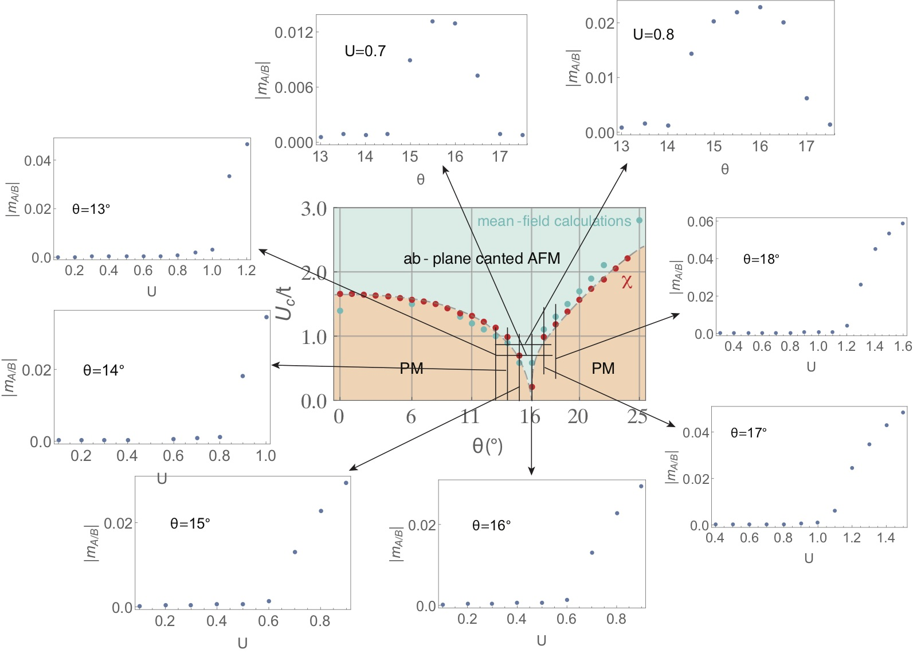

***

iridates 연구에 대한 Memo를 정리해둔다.


***

#### References

[References](ref_iridates.html)


***

2018/06/27(수)

1. 상그림을 mean-field 계산으로 그리고 있는데, rotation distortion angle 15,16 도에서 susceptibility 와 일치하지 않게 Uc 가 높게 나왔다. 이것을 확인하기 위해서 프로그램을 다시 돌리고 있다.

11, 12, 13, 14, 15, 16, 17, 18 각도에 대해서 다시 그리고 있다. 15, 16 만 맞추면 되지만, 수정한 프로그램이 이전 프로그램 결과와 일치하는지 확인하기 위해서 11, 12, 13, 14, 17, 18 역시 같이 돌려보고 있는 것이다.

이후에 할 일은 U를 고정시키고 theta를 바꾸어가면서 계산하는 것이다.

상그림 계산 결과를 첨부하면 다음과 같다.




1. 상그림 계산할 때 중요한 요소는 order parameters가 converge 하냐도 중요하지만, chemical potential 이 정확하게 half-filling 을 유지하느냐도 중요한 요소이다.
그것을 확인하기 위해서 chemical potential 밑에 몇개의 states에 occupy 되었냐를 count 하는 것도 중요함.

1. k mesh 가 64,000 개 있다고 하면 half-filling 을 맞추기 위해서 32,000 상태에 대해서 spin expectation value를 구해야된다. 이것이 half-filling으로 수렴하면 self-consistent iteration 이 끝남을 확인했다.

1. 그러니 self-consistent mean-field 계산에서 중요한 것은 order parameter의 수렴보다는 chemical potential 의 수렴이 아닐까 생각된다. 

1. 이걸로 mean-field 계산에 어느정도 확신은 생겼음.


***

2018/06/12(화)

[STM simulation](ref/STM simulation.pdf)

free-standing 실리신에서 inherent instability 에 의해서 $\alpha$, $\beta$ 두개의 phase가 생길 수 있고, 이 phase 의 domain boundary 에서 soliton 이 생길수 있다는 논문.

우리가 원하는 것은 STM simulation 을 하는 것인데, 이 논문에는 구체적인 STM 공식이 없다.  다른 논문을 찾아야된다. 

그래서 찾은 논문은

1. [STM tutorial note](ref/STM tutorial note.pdf)

제일 원리에서 어떻게 STM simulation 할 것인가 이론적인 배경을 설명하는 note 이다.


***

[Vienna group PRB 2016.pdf](ref/Iridates/Vienna group PRB 2016.pdf)  
이논문에 따르면 electron doping 을 하면 electron-electron correlation effect 가 약해질것이고 왜냐하면 `as a consequence of the increased screening from the metallic
states.` 아무리 약해진다고 해도  5%정도의  약간의 doping만으로 full suppression 을 야기할 수는 없다. LDA calculation in supercell 에 의하면 U_eff = 1.6eV in nondoping 에서 U_eff= 1.4eV 12% doping 으로 야주 작은 감소만 보였다. linear 감소를 가정하면 80%를 doping 해야 full suppression 이 가능하다.   그래서 우리의 DLN 에 의한 instability 이론이 좀더 설득력있을 수 있다.  

```
We found Ueff=1.4 eV, implying that Ueff is only moderately affected by doping at these low concentrations (see Fig.4). Assuming a linear decrease in Ueff upon doping a full suppression of Ueff would occur at very large doping of x≈80%. 
```

***

[Z.Wang PRX 2017.pdf](ref/Iridates/Z.Wang PRX 2017.pdf)

electron doping 을 하면 `d-wave spin-orbit density wave order` 가 develop 되고 이것은 two-fold spin-orbital rotation + lattice translation 을 깬다고 하니까 two-fold screw rotation 을 깨니 남아있는 Glide mirror symmetry에 의해서 Dirac point 가 protect 된다는 우리 시나리오와 일치한다.

```
Electron-doped PM state.—It is remarkable that such a
novel spin-orbit entangled order in the canted AFM phase
can also account for the Fermi pocket, Fermi arc, and
pseudogap phenomena in the PM phase following the
collapse of the AFM insulating gap in electron-doped
Sr2IrO4. Indeed, we could have started the discussion with
the electron-doped case, as we show below, and arrived at
the same conclusion for the d-wave SODW order.
Despite the absence of AFM order, the bands
are still folded by [π, π] due to the staggered IrO6 octahedra
rotation.
```

***

dopinng 을 하면 3가지 효과를 기대할 수 있다.

하나는 electron doping을 해서 chemical potential 의 위치를 변화시키는 일.

다른하나는 doping element 가 nonmagnetic 이기 때문에 AFM gap 을 closing 하는 역할.

또 다른 하나는 새로운 order를 유발해서  이 order 가 깨는 symmetry 때문에 에너지 밴드가 symmetry에 의해 protected 되는 degeneracy 를 깨는 것.

***

2018/05/18(금)

```
물론 Khaliullin model 에 의하면 strong coupling limit 에서 Heisenberg 항만이 아니라 DM 항이 생기고, 이것으로 noncollinear AFM 과 weak FM을 잘 설명한다. 하지만 약간의 oxygen depetion 이나 doping 에 의해서도 AFM insulator 가 metallic state로 바뀌는 것은 어떻게 설명할 수 있을까? 내생각엔 여기에서 weak coupling instability 를 따져보는 것이 의미있다고 생각이 든다. 
```
[oxygen depetion $\delta \sim 0.04$](ref/Iridates/Cao PRB 2010.pdf) 


***

2018/05/16(수)

* spin profile 과 DW magnetism 을 녹색 화살표 기준으로 키워 보았다.

* 이제 supplmentary material 을 작성해보자. 

* 그림을 수정하는 데, eigenvector spin profile을 domain wall 그림과 같이 그려넣어보자.


***

2018/05/15(화)

* spin profile 을 계산해본다.

* domain wall magnetic moment 는 녹색을 기준으로 키워본다.


***

* in-gap 상태의 spin profiles.

* empty channel 의 spin 방향과 energy bands 모양.

* empty 2개는 domain wall profile 이 맞지 않기 때문에 안 된다.

* DW empty line 이 홀수개 있어야 된다.  
-> 그래서 3개의 empty line 을 만들어서 net moment 가 0 이 되게 했는데, in-gap 상태의 Zeeman splitting을 없애지 못했다.


```
candidates

theta domain wall

Neel domain wall

Bloch domain wall
```


2nd direction 도입했는데도 안 된다.

SSH model empty site 도입해보자.

***


